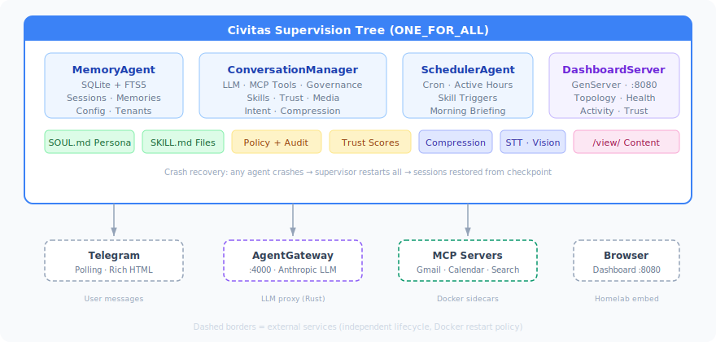

# Nexus

> The reliable personal AI assistant — self-hosted, crash-resilient, governed.

Built on [Civitas](https://github.com/civitas-io/python-civitas) supervision trees. Governed by policy enforcement. Runs on your homelab.

---

## What Nexus Does

Nexus is a self-hosted AI assistant that connects to your email, calendar, and services — and keeps running when things go wrong.

- **Telegram bot** with a configurable personality (Dross, Friday, or create your own)
- **Gmail, Calendar, Tasks** via MCP tool integration — "check my email", "what's on my calendar?"
- **Web search** with no API keys required
- **Morning briefing** delivered at 7am with email, calendar, and task summaries
- **Proactive heartbeat** — pings you when something needs attention, stays silent when it doesn't
- **Trust-gated governance** — write actions require approval until trust is earned
- **Web dashboard** at `:8080` with live topology, agent health, and activity feed
- **Multi-tenant, multi-persona** — different users, different personalities, different trust levels

## What Makes It Different

Every personal AI assistant shares the same weakness: when something crashes, everything stops.

Nexus runs on Civitas supervision trees. Each component is an independent supervised agent. When Gmail crashes, the supervisor restarts it with backoff — your calendar keeps running, your briefing arrives with available data, and Gmail is back before you notice.

| Feature | Nexus | Others |
|---|---|---|
| Crash recovery | Automatic (supervision trees) | Manual restart |
| Governance | Trust-gated approval for write actions | None or all-or-nothing |
| Architecture | Message-passing agents | Monolithic |
| Self-hosted | First-class | Afterthought or impossible |
| Multi-tenant | Built in from day one | Single user |

## Quick Start

### Prerequisites

- Python ≥ 3.12
- [uv](https://github.com/astral-sh/uv) package manager
- Docker (for AgentGateway and MCP servers)
- A Telegram bot token (from [@BotFather](https://t.me/BotFather))
- An Anthropic API key

### 1. Clone and install

```bash
git clone https://github.com/jerynmathew/nexus.git
cd nexus
uv sync --all-extras
```

### 2. Configure

```bash
cp .env.template .env
# Edit .env with your API keys and bot token

cp config.example.yaml config.yaml
# Edit config.yaml with your Telegram user ID and preferences
```

### 3. Start AgentGateway

```bash
docker compose up agentgateway -d
```

### 4. Run Nexus

```bash
source .env
uv run nexus run --config config.yaml
```

Send a message to your bot on Telegram. Nexus responds with the Dross persona by default.

### 5. Add Google Workspace (optional)

```bash
uv run nexus setup-google
docker compose --profile google up -d --build
# Complete OAuth in your browser, then enable in config.yaml
```

Now "check my email" and "what's on my calendar?" work.

## Architecture



- **ConversationManager** handles all user-facing I/O, LLM calls, tool execution, and governance
- **MemoryAgent** persists everything to SQLite with FTS5 search
- **SchedulerAgent** runs cron-based skills (morning briefing, heartbeat)
- **DashboardServer** (GenServer) maintains live health state for the web UI
- **AgentGateway** (Rust sidecar) proxies LLM calls to Anthropic
- **MCP servers** (Docker sidecars) provide tool access to Gmail, Calendar, web search

## Dashboard

The web dashboard at `http://localhost:8080` shows:

- **Topology** — supervision tree with health dots for every agent and external service
- **Agent cards** — status, type, restart count, last active
- **Activity feed** — recent messages and tool calls
- **Trust scores** — per-category trust levels (gmail, calendar, etc.)

Embeddable in homelab dashboards (Homepage, Heimdall, Homarr) via iframe.

## Governance

Nexus doesn't blindly execute actions. It has a trust-gated governance system:

- **Read actions** (search, list, get) → auto-allowed
- **Write actions** (send, create, delete) → require approval via Telegram inline buttons
- **Trust grows** with approved actions (+0.05 per approval)
- **Trust decays** on rejection (-0.10) or policy deny (-0.15)
- **High trust** (> 0.8) → write actions become autonomous
- **Low trust** (< 0.5) → actions denied even with approval

All tool calls are audited to `data/audit.jsonl`.

## Skills

Skills are reusable procedures defined as SKILL.md files. Nexus ships with:

- **Morning briefing** — parallel email + calendar + tasks summary at 7am
- **Heartbeat** — proactive check-in every 30 minutes during active hours

Create your own by adding a SKILL.md file to the `skills/` directory:

```yaml
---
name: my-skill
description: What this skill does
execution: parallel  # or sequential
tool_groups: [google]
schedule: "0 9 * * *"  # optional cron
---

Instructions for the LLM...
```

## Personas

Nexus supports multiple personas via SOUL.md files. Create one interactively:

```bash
uv run nexus setup-persona
```

Or manually create `personas/your-persona.md`. Each user can have different personas for different profiles (work, personal).

## CLI Reference

| Command | Description |
|---|---|
| `nexus run --config config.yaml` | Start the assistant |
| `nexus setup` | First-boot setup wizard |
| `nexus setup-google` | Configure Google Workspace MCP |
| `nexus setup-persona` | Create a new persona interactively |
| `nexus personas list` | List available personas |
| `nexus personas set <name>` | Set active persona |
| `nexus version` | Print version info |

## Development

```bash
# Install with dev dependencies
uv sync --all-extras

# Run tests (167 tests, ~2 seconds)
OTEL_SDK_DISABLED=true uv run pytest tests/ -q

# Lint
uv run ruff check .

# Type check
uv run mypy src/nexus/

# Pre-commit hooks (installed automatically)
uv run pre-commit install
```

### Code Quality

- **Ruff** with 17 rule sets (PEP8, complexity, security, import order)
- **mypy** strict mode
- **Pre-commit hooks** — ruff, mypy, gitleaks (secret scanning), trailing whitespace
- Functions under 50 statements, complexity under 12
- All imports at module level
- 85% coverage target

## Project Structure

```
nexus/
├── src/nexus/
│   ├── agents/          # Civitas AgentProcess subclasses
│   │   ├── conversation.py  # Central routing agent
│   │   ├── memory.py        # SQLite + FTS5 persistence
│   │   ├── scheduler.py     # Cron-based skill triggers
│   │   ├── compressor.py    # Context compression
│   │   └── intent.py        # Intent classification
│   ├── llm/             # LLM client (httpx → AgentGateway)
│   ├── mcp/             # MCP server management
│   ├── transport/       # Telegram, CLI transports
│   ├── persona/         # SOUL.md / USER.md loading
│   ├── skills/          # SKILL.md parser + manager
│   ├── governance/      # Policy engine, audit, trust scores
│   ├── dashboard/       # Web dashboard + content viewer
│   ├── config.py        # Pydantic config models
│   ├── cli.py           # Typer CLI
│   └── runtime.py       # Civitas runtime wiring
├── personas/            # SOUL.md personality files
├── skills/              # SKILL.md skill definitions
├── tests/               # 167 unit + integration tests
├── docs/                # Architecture, design, plans
└── docker-compose.yaml  # AgentGateway + MCP sidecars
```

## Roadmap

| Milestone | Status | Description |
|---|---|---|
| M1 Foundation | ✅ Complete | Telegram bot, supervision tree, memory, crash recovery |
| M2 Integrations | ✅ Complete | MCP tools, Google Workspace, skills, governance, dashboard, compression |
| M3 Depth | ✅ Complete | Trust arc, heartbeat, web search, media (STT/vision), persona builder |
| M4 Breadth | ✅ Complete | Discord, Slack, browser automation, /status, /checkpoint, SSRF protection |
| M5 Extensions | Designed | [Extension architecture](docs/design/extensions.md) — composable plugin system |
| M5 Work Intelligence | Designed | [Work assistant](docs/design/work-assistant.md) — action tracking, delegation, meeting prep (`nexus-work` extension) |
| M6 Production | Planned | Presidium governance, production hardening, community docs |
| M7 Presence | Planned | PWA web app, Android app, animated avatar, TTS voice cloning |

## Extensions

Nexus is a platform. Domain-specific intelligence ships as extensions:

| Extension | Scope | Status |
|---|---|---|
| **nexus-work** | Action tracking, meeting prep, delegation, priority engine | [Designed](docs/design/work-assistant.md) |
| **nexus-finance** | Gold/stocks, charts, buy/sell recommendations | [Designed](docs/design/finance.md) |
| **nexus-homelab** | Service monitoring (Jellyfin, Paperless, etc.) | Planned (skills-only) |

Extensions install via `pip install nexus-work` (code + skills) or by dropping skill folders into `~/.nexus/extensions/`. See [extension architecture](docs/design/extensions.md).

## Ecosystem

Nexus is part of the [civitas-io](https://github.com/civitas-io) ecosystem:

| Repo | Role |
|---|---|
| [python-civitas](https://github.com/civitas-io/python-civitas) | Agent runtime — supervision trees, message passing, OTEL |
| [presidium](https://github.com/civitas-io/presidium) | Governance — policy enforcement, trust scores, audit |
| **nexus** | The platform — personal AI assistant with extension system |
| **nexus-work** | Extension — work intelligence for staff engineers + managers |

## License

Apache 2.0
