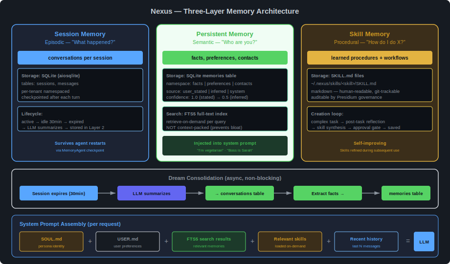

# Memory Architecture

> Three-layer memory system — session, persistent, and skill memory with Dream consolidation.

---

## Overview



Nexus uses a three-layer memory architecture inspired by Hermes Agent's design, adapted for Civitas supervision and Presidium governance. Each layer serves a different cognitive function, uses appropriate storage, and has its own lifecycle.

The core principle: **retrieve-on-demand, not context-packing.** Memory is searched and injected per request, not accumulated into an ever-growing context window. This prevents the context bloat that degrades LLM quality over months of daily use.

---

## Layer 1: Session Memory (Episodic)

**Answers:** "What happened in this conversation?"

| Aspect | Detail |
|---|---|
| Storage | SQLite `sessions` + `messages` tables |
| Lifecycle | active → idle 30min → expired → summarized → completed |
| Scope | Per-session, per-tenant |
| Survives restart? | Yes — checkpointed to MemoryAgent after each turn |

### Schema

```sql
CREATE TABLE sessions (
    id           TEXT PRIMARY KEY,
    tenant_id    TEXT NOT NULL REFERENCES tenants(id),
    status       TEXT NOT NULL DEFAULT 'active',
    started_at   TIMESTAMP DEFAULT CURRENT_TIMESTAMP,
    ended_at     TIMESTAMP,
    summary      TEXT
);

CREATE TABLE messages (
    id           INTEGER PRIMARY KEY AUTOINCREMENT,
    session_id   TEXT NOT NULL REFERENCES sessions(id),
    role         TEXT NOT NULL,          -- 'user', 'assistant', 'tool'
    content      TEXT NOT NULL,
    tool_calls   TEXT,                   -- JSON: [{name, input, result}]
    token_count  INTEGER,
    created_at   TIMESTAMP DEFAULT CURRENT_TIMESTAMP
);
```

### Session Lifecycle

1. **Created** when first message arrives for a tenant with no active session
2. **Active** — messages appended, context loaded for each LLM call
3. **Checkpointed** — serialized to MemoryAgent after each turn (`session.to_dict()`)
4. **Idle timeout** — no activity for 30 minutes → status = `expired`
5. **Summarized** — Dream consolidation runs (async): LLM summarizes full message history → stored in `conversations` table
6. **Completed** — summary stored, facts extracted to persistent memory, session closed

### Crash Recovery

Session state is checkpointed to MemoryAgent (SQLite) after each turn. If ConversationManager crashes and the root supervisor restarts everything:

1. ConversationManager starts with empty in-memory sessions
2. On first message for a tenant, checks MemoryAgent for active session
3. If found, restores from checkpoint — user's multi-turn context preserved
4. If not found, starts new session — at most one turn of context lost

---

## Layer 2: Persistent Memory (Semantic)

**Answers:** "Who is this user? What do they prefer?"

| Aspect | Detail |
|---|---|
| Storage | SQLite `memories` table with FTS5 full-text index |
| Lifecycle | Created by user statement or inferred from conversation, updated over time |
| Scope | Per-tenant, namespaced |
| Search | FTS5 full-text search — zero external dependencies |

### Schema

```sql
CREATE TABLE memories (
    id           INTEGER PRIMARY KEY AUTOINCREMENT,
    tenant_id    TEXT NOT NULL REFERENCES tenants(id),
    namespace    TEXT NOT NULL,
    key          TEXT NOT NULL,
    value        TEXT NOT NULL,          -- JSON
    source       TEXT,                   -- 'user_stated', 'inferred', 'system'
    confidence   REAL DEFAULT 1.0,
    created_at   TIMESTAMP DEFAULT CURRENT_TIMESTAMP,
    updated_at   TIMESTAMP DEFAULT CURRENT_TIMESTAMP,
    UNIQUE(tenant_id, namespace, key)
);

-- FTS5 virtual table for full-text search
CREATE VIRTUAL TABLE memories_fts USING fts5(
    key, value,
    content='memories',
    content_rowid='id'
);
```

### Namespaces

| Namespace | Purpose | Examples |
|---|---|---|
| `facts` | Things the user told Nexus | "I'm vegetarian", "My boss is Sarah Chen" |
| `preferences` | Behavioral preferences learned over time | "Prefers morning meetings", "Likes concise emails" |
| `contacts` | People mentioned frequently | "Sarah = sarah.chen@company.com" |
| `routines` | Recurring patterns observed | "Usually checks email first thing" |
| `system` | Internal state | Scheduler timestamps, agent config |

### Retrieval Pattern

On each request, ConversationManager runs an FTS5 search against the current message:

```python
# Pseudo-code — retrieve relevant memories per request
relevant = await self.ask("memory", {
    "action": "search",
    "tenant_id": tenant.tenant_id,
    "query": message.text,
    "limit": 10,
})
# Inject into system prompt alongside SOUL.md and USER.md
```

This is retrieve-on-demand — only memories relevant to the current topic are loaded. A user with 500 stored facts doesn't pay 500 facts worth of context tokens on every request.

### Source and Confidence

| Source | Confidence | When |
|---|---|---|
| `user_stated` | 1.0 | User explicitly said it: "I'm vegetarian" |
| `inferred` | 0.5 | Extracted from conversation by Dream consolidation |
| `system` | 1.0 | Internal state (scheduler, config) |

Low-confidence memories can be overridden by user corrections. "Actually, I eat fish" → updates the fact, raises confidence to 1.0.

---

## Layer 3: Skill Memory (Procedural)

**Answers:** "How do I do this task?"

| Aspect | Detail |
|---|---|
| Primary storage | Markdown files: `~/.nexus/skills/<skill>/SKILL.md` (Docker volume mount) |
| Backup storage | SQLite `skills` table in MemoryAgent (content + metadata) |
| Export/sync | Optional git repo for version history, portability, and community sharing |
| Lifecycle | Created by agent reflection, imported from community, or discovered from web |
| Scope | Shared (all tenants see all skills) |
| Governance | All skills — local, imported, or discovered — require approval before activation |

### SKILL.md Format

Compatible with OpenClaw and Nanobot conventions, extended with execution directives:

```markdown
---
name: email-triage
description: How to triage and prioritize inbox emails
source: local                    # local | community | discovered
execution: sequential            # sequential | parallel
tool_groups: [gmail]             # MCP tool groups this skill needs
created: 2026-05-15
improved: 2026-05-20
version: 3
approved_by: jeryn               # tenant who approved activation
---

# Email Triage Procedure

When asked to triage the inbox:

1. Fetch unread emails via gmail MCP (search_gmail_messages)
2. Classify each by urgency: immediate / today / this week / archive
3. Immediate: from known contacts, contains action words, has deadline
4. ...

## Pitfalls

- Don't mark newsletters as immediate even if subject looks urgent
- Check if "reply needed" is actually addressed to the user, not CC'd

## Verification

- User should see emails sorted by urgency, not by date
- No email should be in two categories
```

**Parallel skill example (morning briefing):**

```markdown
---
name: morning-briefing
description: Compile and deliver morning briefing
source: local
execution: parallel              # ← sections run concurrently via asyncio.TaskGroup
timeout_per_section: 30          # seconds — per-section timeout
tool_groups: [gmail, calendar, tasks, search]
schedule: "0 7 * * *"           # ← skill declares its own cron schedule
---

# Morning Briefing

## Sections

### 📧 Email Summary
Fetch top 5 unread emails via search_gmail_messages.
Flag emails from known contacts or with action words as important.
Format: sender, subject, one-line summary.

### 📅 Today's Calendar
Fetch today's events via get_events.
Include time, title, and attendees.
Flag conflicts.

### ✅ Pending Tasks
Fetch pending tasks via list_tasks.
Sort by priority. Flag overdue items.

### 🔍 Headlines
Search for top headlines via brave_web_search.
Include gold price if finance tools available.

## Delivery

Send each section to the user as it completes.
If any section fails, note it with ⚠ and continue with available data.
```

### Execution Directives

| Directive | Values | Default | Behavior |
|---|---|---|---|
| `execution` | `sequential` \| `parallel` | `sequential` | Whether `## Sections` run serially or concurrently |
| `timeout_per_section` | seconds | `30` | Per-section timeout (parallel mode). Per-step timeout (sequential mode). |
| `tool_groups` | list of MCP tool groups | `[]` | Which MCP tools to load for this skill. Enables intent-based tool filtering. |
| `schedule` | cron expression | none | If present, SchedulerAgent registers this skill as a cron task. |

### Skill Execution Engine

ConversationManager's skill executor handles both modes:

```python
async def _execute_skill(self, skill: Skill, tenant: TenantContext) -> None:
    tools = self._mcp.filter_tools(skill.tool_groups)

    if skill.execution == "parallel" and skill.sections:
        results: dict[str, str] = {}
        async with asyncio.TaskGroup() as tg:
            for section in skill.sections:
                tg.create_task(
                    self._execute_section(section, tenant, tools, results)
                )
        # Send each completed section to transport
        for section_name, content in results.items():
            await self._send_to_tenant(tenant, content)
    else:
        # Sequential: execute full skill as one LLM call
        await self._execute_sequential(skill, tenant, tools)

async def _execute_section(
    self, section: SkillSection, tenant: TenantContext,
    tools: list, results: dict[str, str],
) -> None:
    try:
        async with asyncio.timeout(section.timeout):
            content = await self._llm_with_tools(
                prompt=section.content,
                tools=tools,
                model_task="SKILL_EXEC",  # → Haiku via ModelRouter
            )
            results[section.name] = content
    except TimeoutError:
        results[section.name] = f"⚠ {section.name}: timed out"
    except Exception as exc:
        results[section.name] = f"⚠ {section.name}: unavailable ({exc})"
```

This gives skills the same parallel execution capability that the old dedicated briefing agents had — but defined in editable markdown, not hardcoded in topology.yaml.

### Three Skill Sources

#### Source 1: Local Creation (agent-generated)

```
Agent completes complex task (e.g., triages inbox for first time)
  → post-task reflection: identifies the procedure it used
  → skill synthesis: writes SKILL.md with procedure, pitfalls, verification
  → approval gate: Telegram [Approve] [Reject] [View]
  → if approved: saved to ~/.nexus/skills/ + backed up to SQLite
  → next similar task: skill loaded → agent starts from learned procedure
  → skill improvement: better approach discovered → proposes update → approval
```

#### Source 2: Community Repo (curated, shared)

A public skills repository (e.g., `civitas-io/nexus-skills`) containing community-contributed and curated procedures.

```bash
# Pull latest community skills
nexus skills sync

# Import a specific skill
nexus skills import email-triage

# Publish a local skill to community repo
nexus skills publish email-triage
# → opens PR against community repo for review
```

**Sync behavior:**
- `nexus skills sync` pulls new/updated skills from the community repo
- New skills are staged as **pending** — not activated until user approves via Telegram
- Updated skills show a diff and require re-approval
- Configurable auto-sync on a schedule (e.g., weekly) via SchedulerAgent
- Community repo is read-only by default; publishing requires contributor access

#### Source 3: Skill Discovery (autonomous, web-sourced)

A background process that searches the web and GitHub for useful procedures, synthesizes them into SKILL.md format, and proposes them for approval.

```
SkillScanner (scheduled, e.g., weekly)
  → searches web/GitHub for procedures relevant to user's integrations
  → filters for quality: structured steps, clear scope, actionable
  → synthesizes into SKILL.md format (LLM-assisted)
  → proposes for approval (same Telegram gate as local skills)
  → if approved: saved locally + backed up to SQLite
  → source field: "discovered" (distinguishes from local and community)
```

**Discovery is governed identically to local creation.** No skill — regardless of source — runs without explicit user approval. This is the Presidium governance principle applied to knowledge acquisition: the agent can learn, but it can't act on new knowledge without human authorization.

### Skill Persistence Model

Skills must survive Docker container restarts, upgrades, and host migrations:

| Layer | What | Survives |
|---|---|---|
| **Filesystem** (primary) | `~/.nexus/skills/` on Docker volume mount | Container restart, upgrade |
| **SQLite** (backup) | `skills` table in MemoryAgent DB | Volume loss (if DB backed up separately) |
| **Git repo** (export) | Optional push to remote repo | Host migration, disaster recovery |

```sql
-- Skills backup table in MemoryAgent
CREATE TABLE IF NOT EXISTS skills (
    name         TEXT PRIMARY KEY,
    description  TEXT NOT NULL,
    content      TEXT NOT NULL,           -- full SKILL.md content
    source       TEXT NOT NULL,           -- 'local' | 'community' | 'discovered'
    version      INTEGER DEFAULT 1,
    approved_by  TEXT,                    -- tenant_id who approved
    approved_at  TIMESTAMP,
    created_at   TIMESTAMP DEFAULT CURRENT_TIMESTAMP,
    updated_at   TIMESTAMP DEFAULT CURRENT_TIMESTAMP
);
```

**Write flow:** When a skill is approved, it's written to both filesystem AND SQLite atomically. If either fails, the skill is not activated.

**Recovery flow:** On startup, MemoryAgent reconciles filesystem and SQLite. Missing files are restored from DB. Missing DB rows are populated from files. This ensures consistency after partial failures.

**Export/import flow:**
```bash
# Export all skills to a git repo (configured in config.yaml)
nexus skills export
# → commits all SKILL.md files to configured repo + pushes

# Import from git repo on a new deployment
nexus skills import --from-repo
# → clones repo → stages all skills as pending → user approves each
```

### Skill Loading

Skills are loaded on-demand, not context-packed:

```python
# ConversationManager — load relevant skills per request
skills_index = self._skills.build_skills_summary()  # names + descriptions
# Index is always in system prompt (~200 tokens)

# If LLM references a skill by name:
skill_content = self._skills.load_skill("email-triage")
# Full SKILL.md injected for that request only
```

---

## Dream Consolidation

Async background process that summarizes expired sessions and extracts facts. Inspired by Nanobot's Dream two-stage system.

### Stage 1: Session Summary

When a session expires (30 min idle):

```python
async def _consolidate_session(self, session: Session) -> None:
    # Summarize full message history
    summary = await self._llm_summarize(session.messages)
    # Store in conversations table
    await self._store_conversation(session.tenant_id, session.id, summary)
    # Mark session completed
    await self._update_session_status(session.id, "completed")
```

### Stage 2: Fact Extraction

After summarization, extract durable facts:

```python
async def _extract_facts(self, tenant_id: str, summary: str) -> None:
    # LLM identifies facts, preferences, contacts from the summary
    facts = await self._llm_extract_facts(summary)
    for fact in facts:
        await self._store_memory(
            tenant_id=tenant_id,
            namespace=fact.namespace,  # "facts", "preferences", "contacts"
            key=fact.key,
            value=fact.value,
            source="inferred",
            confidence=0.5,
        )
```

### Consolidation Properties

- **Async** — runs in background, never blocks the agent loop
- **Non-destructive** — original messages remain in DB; summary is additive
- **Cost-managed** — uses cheap model (Haiku) for summarization and extraction
- **Idempotent** — safe to re-run (checks if session already consolidated)

---

## System Prompt Assembly

On each request, the system prompt is assembled from all memory layers:

```
SOUL.md (persona identity)
  + USER.md (user preferences)
  + FTS5 search results (relevant persistent memories)
  + Relevant skills (loaded on-demand by name)
  + Recent session history (last N messages)
  + Profile/account hints (which Google account for which context)
  = Complete system prompt → LLM
```

Token budget: system prompt targets ~4K tokens max. If memories + skills exceed budget, oldest/least-relevant entries are truncated.

---

## Why Not Vector Search?

FTS5 (SQLite full-text search) was chosen over vector embeddings for Layer 2:

| Criterion | FTS5 | Vector (e.g., sentence-transformers) |
|---|---|---|
| Dependencies | Zero — built into SQLite | sentence-transformers + torch (~2GB) |
| Latency | <1ms | ~50ms per query (embedding + search) |
| Accuracy | Keyword-level — sufficient for explicit facts | Semantic — better for fuzzy queries |
| Memory | Negligible | ~500MB for embedding model |
| Scale threshold | Good up to ~10K entries | Better above ~10K entries |

For a personal assistant with hundreds to low thousands of memories, FTS5 is sufficient. Vector search is a future optional extra (`nexus[vectors]`), not a default dependency.
