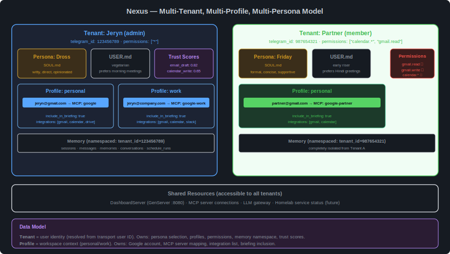

# Multi-Tenant Architecture

> Tenant, profile, and persona model — how Nexus isolates users while sharing infrastructure.

---

## Overview



Nexus supports multiple users on a single instance. Each user has isolated memory, conversation history, persona, and permissions. Shared infrastructure (MCP servers, LLM gateway, dashboard) serves all tenants.

---

## Three Abstractions

### Tenant

A **tenant** is a user identity. It's the isolation boundary — everything is namespaced by `tenant_id`.

```python
class TenantContext(BaseModel, frozen=True):
    tenant_id: str                    # Telegram user ID (string)
    name: str                         # Display name
    role: str                         # "admin" | "member" | "restricted"
    permissions: frozenset[str]       # {"*"} | {"calendar.*", "gmail.read"}
    timezone: str                     # "Asia/Kolkata"
    persona_name: str                 # "Dross" → loads personas/dross.md
    profiles: UserProfiles            # personal, work, etc.
```

**Resolution:** Transport user ID → DB lookup → `TenantContext`. Unknown users rejected.

**Permissions:** Wildcard support via `fnmatch`. `"*"` = admin. `"calendar.*"` = calendar read + write. Read/write distinction enforced: mutating actions require `{service}.write`, reads require `{service}.read`.

### Profile

A **profile** is a workspace context within a tenant. A user may have personal and work profiles, each with separate Google accounts, MCP server mappings, and briefing preferences.

```python
class ProfileConfig(BaseModel):
    accounts: list[WorkspaceAccount]     # Google accounts for this profile
    integrations: list[str]              # ["gmail", "calendar", "slack"]
    include_in_briefing: bool            # Include in morning briefing?

class WorkspaceAccount(BaseModel):
    email: str                           # jeryn@gmail.com
    mcp_server: str                      # key into mcp.servers config

class UserProfiles(BaseModel):
    profiles: dict[str, ProfileConfig]   # "personal" → config, "work" → config
```

**Storage:** Single JSON blob at `(tenant_id, "profiles", "all")` in `user_config` table. One DB read per request — profiles are always needed together.

**Multi-account system prompt:** When a tenant has multiple profiles, the system prompt includes account hints per profile so the LLM selects the correct email address for the context:

```
The user has the following workspace accounts:
- personal: jeryn@gmail.com (via MCP server 'google')
- work: jeryn@company.com (via MCP server 'google-work')
Use the email matching the context.
```

### Persona

A **persona** is the agent's identity — personality, tone, values, communication style. Defined in `SOUL.md` files.

```
personas/
  dross.md       ← witty, direct, opinionated
  friday.md      ← formal, concise, supportive
  default.md     ← helpful, concise, reliable (shipping default)
```

**Per-tenant selection:** Each tenant selects a persona via `user_config`. Different users on the same instance can have different personas.

**User context:** Separate from persona. `USER.md` per tenant stores facts and preferences about the user, not the agent.

**Persona injection:** Both `SOUL.md` (persona) and `USER.md` (user facts) are injected into every LLM system prompt. The persona defines how the agent talks; the user context defines what the agent knows about this specific user.

---

## Data Isolation

| Data type | Isolation level | Storage |
|---|---|---|
| Conversation history | Per-tenant | SQLite `sessions` + `messages` tables, filtered by `tenant_id` |
| Long-term memory | Per-tenant | SQLite `memories` table, namespaced by `tenant_id` |
| Conversation summaries | Per-tenant | SQLite `conversations` table, filtered by `tenant_id` |
| User config | Per-tenant | SQLite `user_config` table, keyed by `(tenant_id, namespace, key)` |
| Persona | Per-tenant selection, shared files | `personas/*.md` files are shared; selection is per-tenant |
| User context | Per-tenant | `~/.nexus/users/{tenant_id}/USER.md` |
| Skills | Shared (future: per-tenant) | `~/.nexus/skills/` — all tenants see all skills initially |
| Trust scores | Per-tenant | `user_config` table, `(tenant_id, "trust", "{action_class}")` |
| Schedule config | Shared (YAML) | `config.yaml` — cron expressions are infrastructure |
| Schedule execution | Per-tenant | SQLite `schedule_runs` table — one briefing per admin tenant |

---

## Config Architecture

Two-layer config (learned from Vigil M4.0):

**YAML (infrastructure — restart to change):**
- `telegram.bot_token` — bot credentials
- `model.*` — LLM provider config, API keys, model names
- `mcp.servers` — MCP sidecar URLs and tool allowlists
- `scheduler.*` — cron expressions
- `dashboard.port` — HTTP port for web dashboard
- `seed.users` — bootstrap seed for first-run tenant creation

**SQLite (user config — live-updateable, no restart):**
- Persona name, personality traits
- User preferences, facts
- Profile/account mappings
- Trust scores
- Transport identity mappings (Telegram ID → tenant_id)

**Seeding:** On first boot, `MemoryAgent.on_start()` reads `seed.users` from YAML and creates `tenants` + `user_config` rows. Idempotent — subsequent boots skip existing tenants.

**Cache:** `TenantConfigCache` with 60-second TTL. Populated lazily from MemoryAgent. Avoids per-message DB round-trip.

---

## Permission Model

### Permission Format

```
{service}.{level}

Examples:
  "*"              → admin, all services, all levels
  "calendar.*"     → calendar read + write
  "gmail.read"     → gmail read only
  "gmail.write"    → gmail read + write (write implies read)
  "homelab.read"   → homelab service queries only
```

### Enforcement

```python
WRITE_ACTIONS = {"create", "send", "delete", "update", "write", "accept", "decline"}

def check_permission(tenant: TenantContext, service: str, action: str) -> bool:
    level = "write" if action in WRITE_ACTIONS else "read"
    required = f"{service}.{level}"
    return tenant.has_permission(required)
```

**Enforcement point:** ConversationManager, before routing to MCP tool execution or custom agent.

### Role Defaults

| Role | Default permissions | Use case |
|---|---|---|
| `admin` | `["*"]` | Primary user — full access |
| `member` | `["calendar.*", "gmail.read", "homelab.read"]` | Household member — can see calendar, read email, check services |
| `restricted` | `["calendar.read", "homelab.read"]` | Guest / child — read-only, limited services |

Permissions are configurable per tenant — roles provide defaults, not hard limits.

---

## Transport Identity Mapping

Each transport resolves its native user ID to a Nexus `tenant_id`:

```
Telegram user 123456789 → tenant_id "123456789"
Discord user 98765      → tenant_id "123456789" (same tenant, different transport)
```

Mapping stored in `user_config`:

```sql
(tenant_id, "transport_ids", "telegram", "123456789")
(tenant_id, "transport_ids", "discord", "98765")
```

This enables cross-transport continuity: a user who talks to Nexus on Telegram and Discord sees the same memory, same persona, same conversation history.

---

## Future: Per-Tenant Supervision Subtrees

Current design: all tenants share one supervision tree. Tenant isolation is at the data level (DB namespacing), not process level.

Future option for high-isolation deployments:

```
root_supervisor
├── tenant_supervisor (ONE_FOR_ONE)
│   ├── jeryn_subtree (own conversation_manager, own session state)
│   └── partner_subtree (own conversation_manager, own session state)
├── shared_services
│   ├── memory (shared, namespaced)
│   ├── dashboard (shared)
│   └── llm_router (shared)
```

This would give per-tenant crash isolation (one tenant's crash doesn't affect another) at the cost of higher memory usage. Not implemented in initial milestones — data-level isolation is sufficient for household scale.
