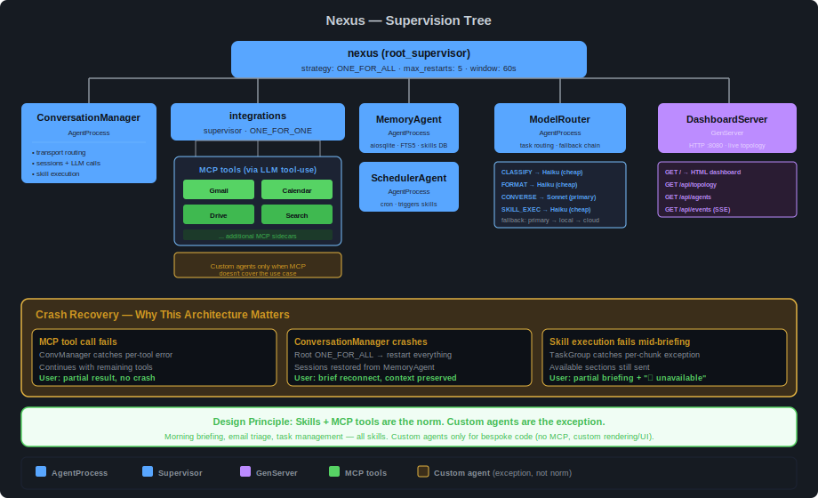
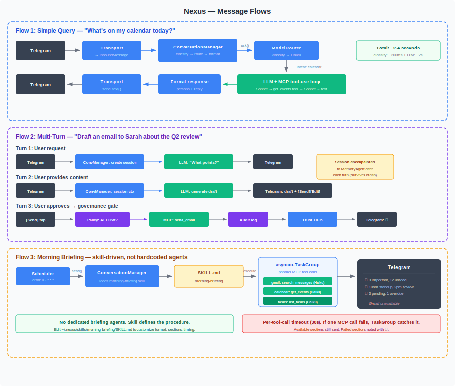

# Architecture Overview

> How Nexus's components fit together — supervision, message flow, and Civitas integration points.

---

## Supervision Tree

The supervision tree is Nexus's primary differentiator. It's what makes crash recovery user-imperceptible and what no competitor can replicate without adopting a supervision-based runtime.



### Agent Inventory

| Agent | Type | Supervisor | Crash Impact | Backoff |
|---|---|---|---|---|
| `conversation_manager` | `AgentProcess` | root (ONE_FOR_ALL) | HIGH — holds session routing state | Immediate |
| `memory` | `AgentProcess` | root (ONE_FOR_ALL) | MEDIUM — other agents lose memory access temporarily | Immediate |
| `scheduler` | `AgentProcess` | root (ONE_FOR_ALL) | MEDIUM — misses scheduled tasks until restart | Immediate |
| `dashboard` | `GenServer` | root (ONE_FOR_ALL) | LOW — dashboard goes offline, agents unaffected | Immediate |
| `llm_router` | `AgentProcess` | root (ONE_FOR_ALL) | HIGH — LLM calls fail until restart | Immediate |
| MCP-backed tools | (via ConvManager) | integrations (ONE_FOR_ONE) | LOW — stateless, re-auth on restart | Exponential, max 30s |
| Custom agents | `IntegrationAgent` | integrations (ONE_FOR_ONE) | LOW — only when no MCP available | Exponential, max 30s |

**Note:** Morning briefing, email triage, and other workflows are **skills**, not agents. They execute inside ConversationManager using the skill system. Custom agents exist only for use cases where MCP doesn't cover the need (bespoke API integration, custom rendering/UI).

### Strategy Rationale

**Root: `ONE_FOR_ALL`** — The conversation manager holds session state that other agents reference (which tenant, which session, which transport to reply on). If it dies, the routing context is inconsistent. Restart everything for a clean state. Sessions are checkpointed to MemoryAgent, so they survive the restart.

**Integrations: `ONE_FOR_ONE`** — Each integration is an independent failure domain. A Gmail API timeout has nothing to do with the Calendar API. Restart only the failed integration. All others continue uninterrupted.

---

## Message Flows



### Flow 1: Simple Query

```
User (Telegram) → Transport → InboundMessage → ConversationManager
  → IntentClassifier (regex or local LLM via ModelRouter)
  → ModelRouter selects model (classify: Haiku, converse: Sonnet)
  → LLM + MCP tool-use loop (get_events → response)
  → Persona-formatted reply
  → Transport → User (Telegram)
```

**Latency:** ~2-4 seconds (classification: ~200ms, LLM + tool call: ~2-3s)

### Flow 2: Multi-Turn Conversation

```
Turn 1: User request → ConversationManager creates session → LLM asks clarifying question → reply
Turn 2: User provides details → session context loaded → LLM generates output → reply with [Approve][Edit]
Turn 3: User taps [Approve] → Policy check (REQUIRE_APPROVAL) → MCP tool call → Audit log → Trust +delta → confirmation
```

**Key behaviors:**
- Session checkpointed to MemoryAgent after each turn — survives agent restart
- Policy evaluation before any mutating action (Presidium governance hook)
- Trust score adjusted after approval/rejection
- Session expires after 30 minutes idle — LLM summarizes, stores in persistent memory

### Flow 3: Morning Briefing (Skill-Driven)

```
Scheduler (cron 07:00) → send() to ConversationManager
  → loads "morning-briefing" SKILL.md
  → executes skill: parallel MCP tool calls via asyncio.TaskGroup
     - search_gmail_messages (Haiku)
     - get_events (Haiku)
     - list_tasks (Haiku)
     - brave_web_search (Haiku, if configured)
  → per-tool-call timeout (30s) — TaskGroup catches failures
  → format results with persona → send to Telegram
```

**Key behaviors:**
- Briefing is a **skill**, not hardcoded agents — editable SKILL.md defines procedure, sections, format
- Skill declares `execution: parallel` — sections run concurrently via `asyncio.TaskGroup`
- Each section gets its own LLM call with relevant MCP tools, using cheap model (Haiku) via ModelRouter
- `timeout_per_section: 30` — per-section timeout. Failed sections noted ("⚠ Gmail unavailable"), available sections still sent
- Total time ≈ slowest section, not sum (~15-20s instead of 60s+ serial)
- Scheduler iterates all admin tenants — each user gets their own briefing
- Customizable: edit `~/.nexus/skills/morning-briefing/SKILL.md` to change format, add/remove sections, adjust timing
- Sequential skills also supported (`execution: sequential`) — the execution mode is a skill property, not a system constraint

---

## Component Architecture

### ConversationManager

The central routing agent. Every user-facing interaction flows through it.

**Owns:** Transport routing, session state, intent classification, LLM calls (via ModelRouter), persona injection, permission checks.

**Design decisions:**
- LLM calls happen here, not in integration agents — single point for prompt engineering and cost control
- Integration agents are stateless data fetchers — they crash and restart freely
- Session state has `to_dict()` / `from_dict()` — deferred restore on first message, not in `on_start()`
- Never sees transport-specific objects — only `InboundMessage` and `reply_transport` reference

### ModelRouter (AgentProcess)

Task-based LLM routing with configurable model selection per task type.

**Routing table:**

| Task | Default Model | Rationale |
|---|---|---|
| `CLASSIFY` | Haiku (cheap) | Intent classification, small payload, fast |
| `FORMAT` | Haiku (cheap) | Response formatting, low complexity |
| `SUMMARIZE` | Haiku (cheap) | Briefing sections, session summaries |
| `CONVERSE` | Sonnet (primary) | Complex multi-tool orchestration, persona adherence |
| `BRIEFING` | Haiku (cheap) | Briefing chunks — separate rate limit |

**Fallback chain:** primary → fallback → local (configurable)
**Circuit breaker:** after N consecutive failures on a model, skip for cooldown period

### DashboardServer (GenServer)

Live topology and health state, served via HTTPGateway.

**GenServer pattern:**
- `handle_call` — synchronous state queries from HTTP API (GET /api/topology, GET /api/agents)
- `handle_cast` — async health updates from agents (status change, restart, message processed)
- `handle_info` — periodic self-tick for metric aggregation

**HTTP endpoints:**
- `GET /` — static HTML dashboard (vanilla JS, no build step)
- `GET /api/health` — overall system health
- `GET /api/topology` — supervision tree structure
- `GET /api/agents` — per-agent status and metrics
- `GET /api/activity` — recent activity feed
- `GET /api/events` — SSE stream for live updates

**Embeddable:** serves on port 8080. Works as iframe in Homepage/Heimdall/Homarr.

### MemoryAgent

Persistent storage for all tenant data. Single writer to SQLite (WAL mode).

**Actions:** `store`, `recall`, `search` (FTS5), `delete`, `save_message`, `config_get`, `config_set`, `config_get_all`

**Schema:** tenants, user_config, sessions, messages, memories (with FTS5 index), conversations, schedule_runs

**Key design:** All payload fields validated with `.get()`. Missing fields return structured error, never crash the agent. (Learned from Vigil issue I2.)

### SchedulerAgent

Cron-based task execution. State persisted to MemoryAgent (survives restarts).

**Key behaviors:**
- Deferred state restore — loads on first tick, not in `on_start()` (MessageBus not ready)
- Iterates all admin tenants for briefing delivery (not hardcoded `users[0]`)
- Fires briefing by triggering the `morning-briefing` skill via ConversationManager

---

## Transport Architecture

```
BaseTransport (Protocol)
  ├── TelegramTransport        → InboundMessage
  ├── DiscordTransport (future) → InboundMessage
  ├── SlackTransport (future)   → InboundMessage
  └── CLITransport (future)     → InboundMessage
         │
         ▼
  ConversationManager (sees only InboundMessage, never transport objects)
         │
         ▼
  reply_transport.send_text(channel_id, text)  ← reply via originating transport
```

**`InboundMessage` dataclass:**
- `tenant_id: str` — resolved by transport from its native user ID
- `text: str` — message content
- `reply_transport: BaseTransport` — reference for replying
- `channel_id: str` — transport-specific channel/chat ID
- `metadata: dict` — transport-specific extras (Telegram message ID, etc.)

**Per-transport tenant resolution:** Each transport implements `resolve_tenant(transport_user_id: str) -> str | None`. Maps Telegram user ID, Discord user ID, etc. to Nexus `tenant_id`. Mapping stored in `user_config` table.

---

## Civitas Integration Points

Nexus uses these Civitas primitives:

| Civitas Primitive | Nexus Usage |
|---|---|
| `AgentProcess` | ConversationManager, MemoryAgent, SchedulerAgent, ModelRouter |
| `GenServer` | DashboardServer (call/cast/info for thread-safe state + HTTP) |
| `Supervisor` | Root (ONE_FOR_ALL), integrations (ONE_FOR_ONE), briefing (ONE_FOR_ONE) |
| `HTTPGateway` | Dashboard web UI on port 8080 |
| `Runtime` | Wires components, manages lifecycle, loads topology.yaml |
| `MessageBus` | All inter-agent communication via `send()` / `ask()` |
| `EvalAgent` | Future: governance evaluation (Presidium integration) |
| `AuditSink` | Governance audit trail (JSONL initially, Presidium `GovernanceAuditSink` later) |
| `RegistryListener` | Future: Presidium agent registry integration |
| OTEL spans | Automatic tracing on all message handling |

---

## Presidium Governance Hooks

Governance is designed into the architecture from day one. Initially implemented as lightweight in-memory policy + trust. Full Presidium integration when packages ship.

| Hook Point | Where in Nexus | What it does |
|---|---|---|
| **Policy check** | ConversationManager, before MCP tool execution | ALLOW / DENY / REQUIRE_APPROVAL per (agent, action, context) |
| **Trust score update** | ConversationManager, after approval/rejection | +delta on approved action, -delta on rejection |
| **Audit entry** | ConversationManager, after every action | Agent identity, action, policy decision, timestamp → JSONL |
| **Credential scoping** | MCP server config | Separate OAuth tokens per MCP sidecar (gmail vs calendar vs drive) |
| **Intent declaration** | ConversationManager, before task start | Declares scope — touching undeclared services triggers alert |
| **Irreversibility gate** | ConversationManager, on mutating MCP tools | send_email, delete_*, accept_invite → REQUIRE_APPROVAL always |

---

## Startup Sequence

1. **Config loads** — YAML parsed, validated by Pydantic, env vars substituted
2. **Runtime initializes** — Civitas `Runtime.from_config("topology.yaml")`
3. **MemoryAgent starts** — SQLite schema created, seed users from config (idempotent)
4. **DashboardServer starts** — GenServer initializes, HTTPGateway binds port 8080
5. **ModelRouter starts** — connects to configured LLM providers, verifies availability
6. **SchedulerAgent starts** — loads cron schedules, defers state restore to first tick
7. **ConversationManager starts** — connects transport (Telegram polling), defers history restore to first message
8. **MCP connections** — async, non-blocking. `asyncio.Event` signals readiness. No busy-wait.
9. **Integration agents start** — health checks on MCP sidecars
10. **Briefing agents start** — ready for next scheduled briefing
11. **System ready** — DashboardServer shows all agents as running
