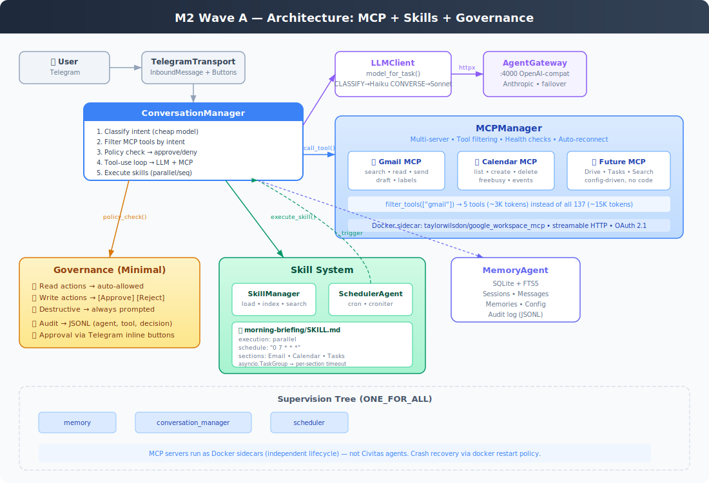

# M2 Wave A Implementation Plan — "It knows your email, calendar, and services"

> Version: 1.0
> Created: 2026-05-09
> Status: Review
> Depends on: M1 complete (29 commits, 89 tests, live Telegram bot)

---

## Architecture



## Scope

**Wave A** ships the daily-driver features: MCP tool integration, Google Workspace, scheduled skills, and safety gates. **Wave B** (dashboard, context compression) follows separately.

| Sub-milestone | What ships | Build order |
|---|---|---|
| **M2.3** Task routing | `model_for_task()` in LLMClient — Haiku for classify/summarize, Sonnet for converse | 1st |
| **M2.1** MCP Infrastructure | MCPManager using official `mcp` SDK — multi-server, tool filtering, health checks | 2nd |
| **M2.7** Governance | Write actions → Telegram [Approve] [Reject]. JSONL audit log. | 3rd |
| **M2.4** Scheduler + Skills | SkillManager (SKILL.md loader), SchedulerAgent cron, morning briefing | 4th |
| **M2.2** Google Workspace | `taylorwilsdon/google_workspace_mcp` Docker sidecar, OAuth setup, integration test | 5th |

## Key Decisions (settled)

| # | Decision | Rationale |
|---|---|---|
| 1 | **Official `mcp` SDK** for MCP clients | Already in deps, protocol-correct, maintained by Anthropic. Civitas `fabrica` not yet published. |
| 2 | **No ModelRouter agent** | `model_for_task()` on LLMClient. AgentGateway handles failover. Full router deferred to when cost pressure is real. |
| 3 | **Wave A/B split** | Daily-driver features first. Dashboard and compression don't block usability. |
| 4 | **`taylorwilsdon/google_workspace_mcp`** | Most mature (2K+ stars), 137 tools, Docker + streamable HTTP, OAuth 2.1. |
| 5 | **Minimal governance** | Write→prompt, read→auto, JSONL audit. Trust scores in Wave B. |
| 6 | **Generic skill system** | SkillManager loads any SKILL.md. Morning briefing is just the first skill. |

---

## Task Breakdown

### Phase 1: M2.3 — Task-Based Model Routing

> Simple model selection by task type. Enables cheap model for classification and summarization.

#### T2.3.1 — LLMClient task routing
- [ ] Add `model_for_task(task: str) -> str` method to `LLMClient`
- [ ] Task types: `CLASSIFY`, `SUMMARIZE`, `FORMAT` → config.llm.cheap_model; `CONVERSE` → config.llm.model
- [ ] Add `cheap_model` field to `LLMConfig` (default: `claude-haiku-4-20250414`)
- [ ] ConversationManager uses `model_for_task("CLASSIFY")` for intent classification
- [ ] Wire through: config → LLMClient constructor → model selection
- **Tests:**
  - [ ] `model_for_task("CLASSIFY")` returns cheap model
  - [ ] `model_for_task("CONVERSE")` returns primary model
  - [ ] Unknown task defaults to primary model

#### T2.3.2 — AgentGateway multi-model config
- [ ] Update `agentgateway.yaml` to register both claude-sonnet and claude-haiku
- [ ] Verify both models work via curl
- **Tests:** curl test for each model

**Phase 1 exit:** ConversationManager uses cheap model for intent classification, primary for conversation.

---

### Phase 2: M2.1 — MCP Infrastructure

> MCPManager connects to MCP servers via the official `mcp` SDK. Tool schemas are merged, filtered by intent, and routed to the correct server.

#### T2.1.1 — MCP config models
- [ ] Add to `NexusConfig`: `mcp` section with `servers` list
- [ ] `MCPServerConfig` Pydantic model: name, transport (stdio | sse | streamable-http), url, command, args, env, enabled, tool_group
- [ ] Config validation: sse/streamable-http requires url, stdio requires command
- **Tests:**
  - [ ] Valid config parses
  - [ ] Missing url for sse transport errors
  - [ ] Disabled servers skipped

#### T2.1.2 — MCPManager core (`src/nexus/mcp/manager.py`)
- [ ] `MCPManager` class:
  - `connect_all(servers: list[MCPServerConfig]) -> None` — connects to all enabled servers
  - `call_tool(tool_name: str, arguments: dict) -> str` — routes to correct server
  - `filter_tools(tool_groups: list[str]) -> list[dict]` — returns OpenAI-format tool schemas
  - `all_tool_schemas() -> list[dict]` — all tools in OpenAI format
  - `health_check() -> dict[str, bool]` — ping each server
  - `close() -> None` — disconnect all
- [ ] Uses `mcp.ClientSession` with `sse_client` or `stdio_client` based on transport
- [ ] Tool schemas converted to OpenAI function-calling format for LLMClient
- [ ] `asyncio.Event` for readiness (no busy-wait)
- [ ] Per-server error isolation — one server failing doesn't block others
- **Tests:**
  - [ ] `tests/unit/test_mcp_manager.py`:
    - Mock MCP server responses
    - Tool schema listing
    - Tool filtering by group
    - call_tool routes to correct server
    - Health check with mock
    - Graceful handling when server unavailable

#### T2.1.3 — MCPManager auto-reconnect
- [ ] On `call_tool` failure: attempt reconnect once, then raise
- [ ] On health_check failure: mark server as unhealthy, attempt reconnect on next call
- [ ] Log reconnection attempts
- **Tests:**
  - [ ] Reconnect on transient failure
  - [ ] Unhealthy server marked, reconnect attempted

#### T2.1.4 — Wire MCPManager into ConversationManager
- [ ] ConversationManager creates MCPManager in `on_start()`
- [ ] `_tool_use_loop` calls `mcp_manager.call_tool()` instead of returning stub text
- [ ] Intent classifier's `tool_groups` field used to filter tools per request
- [ ] Tool schemas passed to LLM call
- **Tests:**
  - [ ] Integration test: ConversationManager + mock MCP server → tool call → response

**Phase 2 exit:** MCPManager connects to MCP servers, lists tools, calls tools, filters by group. ConversationManager's tool-use loop is fully functional.

---

### Phase 3: M2.7 — Governance (Minimal)

> Write actions require user approval via Telegram inline buttons. All tool calls audited.

#### T2.7.1 — Policy engine (`src/nexus/governance/policy.py`)
- [ ] `PolicyDecision` enum: `ALLOW`, `DENY`, `REQUIRE_APPROVAL`
- [ ] `PolicyEngine` class:
  - `check(tool_name: str, arguments: dict) -> PolicyDecision`
  - Classify by tool name pattern: `search_*`, `list_*`, `get_*` → `ALLOW`; `send_*`, `create_*`, `delete_*`, `update_*` → `REQUIRE_APPROVAL`
- [ ] Hardline deny list: patterns that are always denied (configurable)
- **Tests:**
  - [ ] Read tools → ALLOW
  - [ ] Write tools → REQUIRE_APPROVAL
  - [ ] Blocked patterns → DENY

#### T2.7.2 — Audit sink (`src/nexus/governance/audit.py`)
- [ ] `AuditSink` class:
  - `log(entry: AuditEntry) -> None` — append to JSONL file
  - `AuditEntry`: timestamp, agent, tool_name, arguments (redacted), decision, tenant_id
- [ ] JSONL format: one JSON object per line, append-only
- [ ] Configurable path (default: `data/audit.jsonl`)
- **Tests:**
  - [ ] Entries written to JSONL file
  - [ ] Entry format is valid JSON per line
  - [ ] Sensitive fields redacted (API keys, passwords)

#### T2.7.3 — Approval flow in ConversationManager
- [ ] Before each tool call in `_tool_use_loop`:
  1. `policy_engine.check(tool_name, arguments)`
  2. If `ALLOW` → execute immediately
  3. If `REQUIRE_APPROVAL` → send Telegram inline buttons [Approve] [Reject], pause execution
  4. If `DENY` → return denial message, log to audit
- [ ] On approval callback: resume tool call, log to audit
- [ ] On rejection callback: return "Action cancelled", log to audit
- [ ] Approval state stored per-session (survives within session, not across restarts)
- **Tests:**
  - [ ] Read tool → auto-executed, audit logged
  - [ ] Write tool → buttons sent, execution paused
  - [ ] Approval callback → tool executed
  - [ ] Rejection callback → cancelled message
  - [ ] Denied tool → never executed

#### T2.7.4 — Wire governance into tool-use loop
- [ ] Update `_tool_use_loop` to call policy engine before each tool
- [ ] Update `_handle_transport_callback` to handle approval/rejection
- [ ] Audit every tool call (allowed, approved, rejected, denied)
- **Tests:**
  - [ ] End-to-end: inbound message → tool call → approval → result → audit entry

**Phase 3 exit:** Write actions prompt user for approval. All tool calls audited to JSONL. Denied actions never execute.

---

### Phase 4: M2.4 — Scheduler + Skill System

> Generic skill loading from SKILL.md files. Cron-based scheduler triggers skills.

#### T2.4.1 — SKILL.md parser (`src/nexus/skills/parser.py`)
- [ ] `Skill` dataclass: name, description, execution (parallel | sequential), tool_groups, schedule, sections (list[SkillSection]), content
- [ ] `SkillSection` dataclass: name, content, timeout (default 30s)
- [ ] Parse YAML frontmatter from SKILL.md files
- [ ] Parse `## Sections` as individual `SkillSection` objects
- [ ] Validate: name required, execution mode valid
- **Tests:**
  - [ ] Parse valid SKILL.md with frontmatter + sections
  - [ ] Parse sequential skill (no sections)
  - [ ] Missing name → error
  - [ ] Default values applied

#### T2.4.2 — SkillManager (`src/nexus/skills/manager.py`)
- [ ] `SkillManager` class:
  - `load_all(skills_dir: Path) -> None` — scan directory, parse all SKILL.md
  - `get(name: str) -> Skill | None`
  - `list_skills() -> list[Skill]`
  - `build_summary() -> str` — names + descriptions for system prompt
  - `get_scheduled() -> list[Skill]` — skills with `schedule` field
- [ ] Watch `skills_dir` for changes (reload on next access, not file watcher)
- **Tests:**
  - [ ] Load directory with multiple skills
  - [ ] Get by name
  - [ ] Summary includes all skills
  - [ ] Scheduled skills filtered correctly

#### T2.4.3 — Skill execution in ConversationManager
- [ ] `_execute_skill(skill: Skill, tenant: TenantContext)`:
  - If `execution == "parallel"` and has sections → `asyncio.TaskGroup`
  - If `execution == "sequential"` → single LLM call with full skill content
  - Per-section: get tools from MCPManager, call LLM with cheap model, timeout per section
  - Failed sections: note with ⚠, continue with available data
- [ ] Send each section result to transport as it completes
- **Tests:**
  - [ ] Sequential skill execution (mock LLM)
  - [ ] Parallel skill with 3 sections (mock LLM + TaskGroup)
  - [ ] Section timeout → ⚠ message, other sections succeed
  - [ ] Section failure → ⚠ message, other sections succeed

#### T2.4.4 — SchedulerAgent cron engine
- [ ] Replace stub with real cron loop:
  - `on_start()`: set `_state_loaded = False`
  - First `handle()`: load state from MemoryAgent (deferred init)
  - `send_after(60_000, {"action": "tick"})` — 1-minute tick loop
  - On each tick: check all scheduled skills against current time using `croniter`
  - If skill due: send `{"action": "execute_skill", "skill_name": "..."}` to ConversationManager for each admin tenant
  - Track last run per skill per tenant in `schedule_runs` table
- [ ] Deferred state restore: loads last run times from MemoryAgent on first tick
- [ ] Iterate all admin tenants for each scheduled skill (not hardcoded `users[0]`)
- **Tests:**
  - [ ] Tick triggers skill when cron matches
  - [ ] Tick does not trigger when already ran in current window
  - [ ] State restore from MemoryAgent
  - [ ] Multiple tenants each get their own trigger

#### T2.4.5 — Morning briefing SKILL.md
- [ ] Create `skills/morning-briefing/SKILL.md`:
  ```yaml
  name: morning-briefing
  description: Compile and deliver morning briefing
  execution: parallel
  timeout_per_section: 30
  tool_groups: [gmail, calendar, tasks]
  schedule: "0 7 * * *"
  ```
- [ ] Sections: Email Summary, Today's Calendar, Pending Tasks
- [ ] Each section uses relevant MCP tools
- [ ] Ship as default skill in `skills/` directory
- **Tests:**
  - [ ] SKILL.md parses correctly
  - [ ] SkillManager loads it from directory
  - [ ] SchedulerAgent identifies it as scheduled

**Phase 4 exit:** SkillManager loads SKILL.md files. SchedulerAgent runs cron. Morning briefing triggers at 7am for all admin tenants. Sections run in parallel with per-section timeouts.

---

### Phase 5: M2.2 — Google Workspace via MCP

> taylorwilsdon/google_workspace_mcp as Docker sidecar. OAuth setup. "What's on my calendar?" works.

#### T2.2.1 — Docker compose for Google Workspace MCP
- [ ] Add `mcp-google` service to `docker-compose.yaml`:
  - Image: `taylorwilsdon/google_workspace_mcp:latest` (or pinned version)
  - Transport: streamable HTTP on port 8000
  - Volumes: credentials directory for OAuth token persistence
  - Environment: `ENABLED_SERVICES=gmail,calendar,tasks`, `MCP_TRANSPORT=streamable-http`
- [ ] Document OAuth setup flow: create Google Cloud project, enable APIs, create OAuth credentials

#### T2.2.2 — Config for Google Workspace MCP
- [ ] Add MCP server config to `config.example.yaml`:
  ```yaml
  mcp:
    servers:
      - name: google
        transport: streamable-http
        url: "http://mcp-google:8000/mcp"
        tool_group: google
        enabled: true
  ```
- [ ] MCPManager connects to google MCP on startup
- [ ] Tool schemas auto-discovered

#### T2.2.3 — OAuth setup wizard
- [ ] `nexus setup google` CLI command:
  - Prompts for Google OAuth client ID and secret
  - Opens browser for OAuth authorization
  - Stores token in credentials volume
  - Verifies connection by listing tools
- **Tests:**
  - [ ] CLI command exists and shows help
  - [ ] Mock OAuth flow produces valid config

#### T2.2.4 — Integration test
- [ ] `tests/integration/test_google_mcp.py`:
  - Requires Google Workspace MCP sidecar running (skipped if not available)
  - Connect MCPManager → list tools → verify gmail/calendar tools present
  - Call a read tool (list_events or search_messages) → verify response
- **Tests:**
  - [ ] Tool listing includes expected Gmail and Calendar tools
  - [ ] Read tool call returns structured response

**Phase 5 exit:** "What's on my calendar today?" → MCP tool call → accurate response. "Check my email" → MCP tool call → email summary. "Send this email" → approval gate → user confirms → sent.

---

## Wave A Exit Criteria

| Criterion | How to verify |
|---|---|
| "What's on my calendar today?" → accurate response | Manual: Telegram message → calendar tool call → events listed |
| "Summarize my unread emails" → useful summary | Manual: Telegram → gmail tool call → email summary |
| "Send this email" → approval gate → confirm → sent | Manual: write action triggers [Approve] button |
| Morning briefing at 7am with email + calendar sections | Manual: wait for 7am or trigger via test |
| Intent classification uses cheap model | Verify via AgentGateway logs (model=haiku for classify) |
| All tool calls audited to JSONL | Inspect `data/audit.jsonl` after tool calls |
| Kill Gmail MCP sidecar mid-briefing → available sections still sent | Manual: docker stop mcp-google during briefing |

---

## Test Strategy

### Unit Tests
- MCPManager: mock `mcp.ClientSession`, verify tool listing/filtering/routing
- PolicyEngine: tool name → decision mapping
- AuditSink: JSONL write + format validation
- SkillManager: SKILL.md parsing, loading, filtering
- SchedulerAgent: cron matching, state persistence
- LLMClient: model_for_task routing

### Integration Tests
- ConversationManager + MockMCP → tool-use loop produces correct response
- SchedulerAgent + ConversationManager → skill triggers and executes
- Governance flow: tool call → approval → execution → audit entry
- Google Workspace MCP (requires sidecar, skipped in CI)

---

## Files Created/Modified (Estimated)

### New Source
- `src/nexus/mcp/__init__.py`
- `src/nexus/mcp/manager.py` — MCPManager
- `src/nexus/governance/__init__.py`
- `src/nexus/governance/policy.py` — PolicyEngine
- `src/nexus/governance/audit.py` — AuditSink
- `src/nexus/skills/parser.py` — SKILL.md parser
- `src/nexus/skills/manager.py` — SkillManager

### Modified Source
- `src/nexus/config.py` — MCP config, cheap_model field
- `src/nexus/llm/client.py` — model_for_task()
- `src/nexus/agents/conversation.py` — MCP integration, governance hooks, skill execution
- `src/nexus/agents/scheduler.py` — real cron engine
- `src/nexus/runtime.py` — wire MCPManager, SkillManager

### New Config
- `skills/morning-briefing/SKILL.md`
- Updated `agentgateway.yaml` (add haiku model)
- Updated `docker-compose.yaml` (add mcp-google sidecar)
- Updated `config.example.yaml` (MCP + governance config)

### New Tests
- `tests/unit/test_mcp_manager.py`
- `tests/unit/test_policy.py`
- `tests/unit/test_audit.py`
- `tests/unit/test_skill_parser.py`
- `tests/unit/test_skill_manager.py`
- `tests/unit/test_scheduler_cron.py`
- `tests/unit/test_task_routing.py`
- `tests/integration/test_tool_use_loop.py`
- `tests/integration/test_governance_flow.py`
- `tests/integration/test_skill_execution.py`
- `tests/integration/test_google_mcp.py`

---

## Dependency Order

```
T2.3.1 Task routing ──── T2.3.2 AgentGateway config
    │
T2.1.1 MCP config models
    │
T2.1.2 MCPManager core
    │
    ├── T2.1.3 Auto-reconnect
    │
    └── T2.1.4 Wire into ConversationManager
              │
              ├── T2.7.1 Policy engine
              │     │
              │     ├── T2.7.2 Audit sink
              │     │
              │     └── T2.7.3 Approval flow
              │           │
              │           └── T2.7.4 Wire governance
              │
              ├── T2.4.1 SKILL.md parser
              │     │
              │     ├── T2.4.2 SkillManager
              │     │     │
              │     │     └── T2.4.3 Skill execution
              │     │
              │     └── T2.4.4 Scheduler cron
              │           │
              │           └── T2.4.5 Morning briefing
              │
              └── T2.2.1 Docker compose
                    │
                    ├── T2.2.2 Config
                    │
                    ├── T2.2.3 OAuth wizard
                    │
                    └── T2.2.4 Integration test
```

---

## Progress Tracking

| Phase | Task | Status | Notes |
|---|---|---|---|
| 1 | T2.3.1 Task routing | ✅ Done | model_for_task() with cheap/primary split |
| 1 | T2.3.2 AgentGateway config | ✅ Done | Both sonnet + haiku registered |
| 2 | T2.1.1 MCP config models | ✅ Done | MCPServerEntry, MCPConfig, GovernanceConfig |
| 2 | T2.1.2 MCPManager core | ✅ Done | mcp SDK, sse/streamable-http/stdio, tool filtering |
| 2 | T2.1.3 Auto-reconnect | ✅ Done | _reconnect_server on failure |
| 2 | T2.1.4 Wire into ConversationManager | ✅ Done | set_mcp_manager(), tool fallback to all tools |
| 3 | T2.7.1 Policy engine | ✅ Done | Read→ALLOW, Write→REQUIRE_APPROVAL, deny list |
| 3 | T2.7.2 Audit sink | ✅ Done | JSONL append, argument redaction |
| 3 | T2.7.3 Approval flow | ✅ Done | Callback handling for approve/reject |
| 3 | T2.7.4 Wire governance | ✅ Done | Policy check + audit before every tool call |
| 4 | T2.4.1 SKILL.md parser | ✅ Done | YAML frontmatter + section parsing |
| 4 | T2.4.2 SkillManager | ✅ Done | Load, index, search, scheduled filter |
| 4 | T2.4.3 Skill execution | ✅ Done | Parallel (TaskGroup) + sequential modes |
| 4 | T2.4.4 Scheduler cron | ✅ Done | croniter.match, tick loop, state persistence |
| 4 | T2.4.5 Morning briefing | ✅ Done | SKILL.md with email/calendar/tasks sections |
| 5 | T2.2.1 Docker compose | ✅ Done | Build from source, streamable-http, OAuth |
| 5 | T2.2.2 Config | ✅ Done | MCP + governance + skills_dir in config |
| 5 | T2.2.3 OAuth wizard | ✅ Done | nexus setup-google CLI + .env.template |
| 5 | T2.2.4 Integration test | ✅ Done | Live: "check my email" → Gmail via MCP → response |

**All 19 tasks complete. Live verified: Gmail tool calls via MCP working on Telegram.**

### Post-Wave-A fixes (also shipped)
- Tool-use loop: added `type: function` + `json.dumps(arguments)` for OpenAI format
- MCP result parsing: handle isError, ImageContent, EmbeddedResource
- Telegram formatting: markdown→HTML conversion, message splitting at 4096 chars
- Google MCP: build from source (no pre-built image), TOOLS space-separated, GOOGLE_EMAIL env
