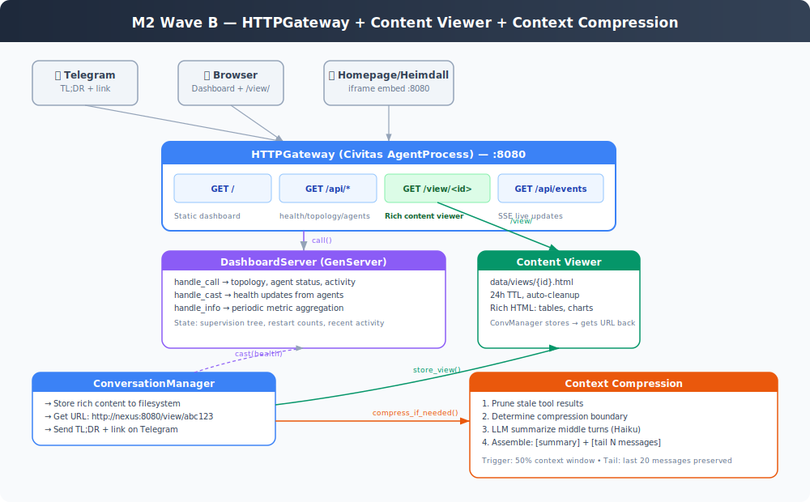

# M2 Wave B Implementation Plan — Dashboard + Content Viewer + Context Compression

> Version: 1.0
> Created: 2026-05-09
> Status: Review
> Depends on: M2 Wave A complete

---

## Architecture



## Scope

Wave B adds the web surface and conversation durability.

| Component | What ships |
|---|---|
| **HTTPGateway + DashboardServer** | Web dashboard at `:8080` with agent topology, health, activity feed |
| **Content Viewer** | `/view/<id>` serves rich HTML for long responses. Telegram gets TL;DR + link. |
| **Context Compression** | 4-phase compression when conversation hits 50% context window |

## Key Decisions

| # | Decision | Rationale |
|---|---|---|
| 1 | Civitas HTTPGateway + DashboardServer(GenServer) | Architecture-consistent. Supervised, bus-integrated, OTEL traced. |
| 2 | Filesystem for content views | HTML files in `data/views/` with 24h TTL. Survives restarts, easy cleanup. |
| 3 | Context compression in Wave B | Essential for daily use. Without it, conversations degrade after ~20 messages. |

---

## Task Breakdown

### Phase 1: HTTPGateway + DashboardServer

> Web dashboard on `:8080`. DashboardServer(GenServer) holds live state, HTTPGateway serves it.

#### T2.5.1 — DashboardServer GenServer (`src/nexus/dashboard/server.py`)
- [ ] `DashboardServer(GenServer)` — maintains live state:
  - Supervision tree topology (agent names, types, parent-child)
  - Per-agent health (status, restart count, last message timestamp)
  - Recent activity feed (last 100 entries: agent, action, latency)
  - MCP server connectivity (connected/disconnected, tool count)
- [ ] `init()`: initialize empty state dicts
- [ ] `handle_call(payload, from_)`:
  - `get_topology` → returns supervision tree structure
  - `get_agents` → returns per-agent status dict
  - `get_activity` → returns recent activity list
  - `get_health` → returns overall health summary
- [ ] `handle_cast(payload)`:
  - `agent_health` → update agent status (from lifecycle events)
  - `activity` → append to activity feed (capped at 100)
  - `mcp_status` → update MCP connectivity
- [ ] `handle_info(payload)`:
  - `tick` → periodic aggregation (every 30s via send_after)
- **Tests:**
  - [ ] `tests/unit/test_dashboard_server.py`:
    - handle_call returns correct state
    - handle_cast updates state
    - Activity feed capped at 100
    - Topology structure correct

#### T2.5.2 — HTTPGateway routes (`src/nexus/dashboard/gateway.py`)
- [ ] Custom subclass or route config for Civitas HTTPGateway
- [ ] Routes:
  - `GET /` → serve static HTML dashboard page
  - `GET /api/health` → call DashboardServer `get_health`
  - `GET /api/topology` → call DashboardServer `get_topology`
  - `GET /api/agents` → call DashboardServer `get_agents`
  - `GET /api/activity` → call DashboardServer `get_activity`
  - `GET /view/<id>` → serve HTML file from `data/views/`
  - `GET /api/events` → SSE stream (optional, polling fallback)
- [ ] Static files served from `src/nexus/dashboard/static/`
- [ ] JSON responses for `/api/*` endpoints
- [ ] Add `uvicorn` to dependencies if not already available
- **Tests:**
  - [ ] `tests/unit/test_dashboard_gateway.py`:
    - Health endpoint returns valid JSON
    - Unknown view ID returns 404
    - Static dashboard page served

#### T2.5.3 — Static HTML dashboard (`src/nexus/dashboard/static/`)
- [ ] Single HTML file — vanilla JS, no build step
- [ ] Sections:
  - Supervision tree visualization (agent cards with status indicators)
  - Agent health cards (name, status, restart count, last active)
  - Recent activity feed (scrolling list)
  - MCP server connectivity indicators
- [ ] Polling `/api/agents` and `/api/activity` every 5 seconds
- [ ] Embeddable in Homepage/Heimdall via iframe
- [ ] Dark/light theme via CSS media query
- **Tests:**
  - [ ] HTML file exists and is valid
  - [ ] JS fetches correct API endpoints (manual verification)

#### T2.5.4 — Wire into supervision tree
- [ ] Add DashboardServer and HTTPGateway to topology
- [ ] Update `build_runtime()` to create and wire both
- [ ] Agents send health updates to DashboardServer via `cast()` on lifecycle events
- [ ] ConversationManager sends activity entries on each request
- [ ] Config: `dashboard.port` (default 8080), `dashboard.enabled` (default true)
- **Tests:**
  - [ ] `tests/integration/test_dashboard.py`:
    - Runtime starts with dashboard
    - HTTP health endpoint responds
    - Agent status reflected in topology

**Phase 1 exit:** Open `http://localhost:8080` → see agent topology, health status, activity feed. Embeddable in homelab dashboards.

---

### Phase 2: Content Viewer

> ConversationManager stores rich HTML for long responses. Telegram gets TL;DR + link.

#### T2.5.5 — Content store (`src/nexus/dashboard/views.py`)
- [ ] `ContentStore` class:
  - `store(content: str, title: str = "", ttl_hours: int = 24) -> str` — write HTML to `data/views/{id}.html`, return ID
  - `get(view_id: str) -> str | None` — read HTML file if exists and not expired
  - `cleanup()` — delete expired files
  - ID: short UUID (8 chars)
- [ ] HTML wrapper: full page with CSS styling, title, timestamp
- [ ] TTL: check file mtime on read, skip if older than ttl_hours
- [ ] Cleanup: called periodically by DashboardServer tick
- **Tests:**
  - [ ] `tests/unit/test_content_store.py`:
    - Store and retrieve roundtrip
    - Expired content returns None
    - Cleanup deletes old files
    - HTML wrapper includes title and content

#### T2.5.6 — Wire into ConversationManager
- [ ] After LLM response, if response length > threshold (e.g., 2000 chars):
  - Store full response as rich HTML via ContentStore
  - Generate TL;DR (first 200 chars or LLM summary)
  - Send on Telegram: TL;DR + "See full details → {url}"
- [ ] If response is short: send directly as before
- [ ] URL format: `http://{host}:{port}/view/{id}`
- [ ] Config: `dashboard.host` for constructing URLs (default: localhost)
- **Tests:**
  - [ ] Short response → sent directly
  - [ ] Long response → stored + link sent
  - [ ] View URL accessible via HTTPGateway

**Phase 2 exit:** Long email summary → Telegram shows TL;DR + link → click → rich HTML page with full content.

---

### Phase 3: Context Compression

> Compress conversation history when approaching context window limits.

#### T2.6.1 — ContextCompressor (`src/nexus/agents/compressor.py`)
- [ ] `ContextCompressor` class:
  - `compress(messages: list[dict], max_tokens: int, llm: LLMClient) -> list[dict]`
  - Returns compressed message list
- [ ] 4-phase compression:
  1. **Prune tool results**: replace tool result content with `"[tool result: {tool_name} — summarized]"` for results older than tail
  2. **Determine boundary**: find the split point — preserve last N messages (configurable, default 20)
  3. **Summarize middle**: send messages between summary and tail to LLM (cheap model) for summarization
  4. **Assemble**: `[system] + [summary message] + [tail messages]`
- [ ] Token estimation: rough count at 4 chars per token
- [ ] Trigger threshold: configurable (default 50% of max context)
- [ ] Iterative: if already has a summary, update it rather than re-summarize from scratch
- [ ] Tail protection: last N messages always preserved verbatim
- **Tests:**
  - [ ] `tests/unit/test_compressor.py`:
    - Short conversation → no compression
    - Long conversation → compressed with summary
    - Tool results pruned in old messages
    - Tail messages preserved verbatim
    - Existing summary updated, not re-created
    - Token estimation roughly correct

#### T2.6.2 — Wire into ConversationManager
- [ ] Before each LLM call, check if messages exceed threshold
- [ ] If threshold exceeded: compress, update session messages
- [ ] Summary stored as a special message with role `"system"` and marker
- [ ] Checkpoint compressed session to MemoryAgent
- **Tests:**
  - [ ] Integration: long conversation triggers compression
  - [ ] Compressed session still produces valid responses

**Phase 3 exit:** 50-message conversation doesn't degrade. Context stays under budget. Sessions persist compressed state across restarts.

---

## Wave B Exit Criteria

| Criterion | How to verify |
|---|---|
| Dashboard at `http://localhost:8080` shows topology + health | Open browser, verify agent cards |
| Dashboard embeddable in Homepage/Heimdall | Test iframe embed |
| Long email summary → TL;DR + link on Telegram | Ask for email, verify link works |
| Click link → rich HTML page with full content | Open /view/ URL in browser |
| 50-message conversation stays responsive | Extended conversation test |
| Agent restart reflected in dashboard | Kill agent, check restart count updates |

---

## Files Created/Modified

### New Source
- `src/nexus/dashboard/server.py` — DashboardServer(GenServer)
- `src/nexus/dashboard/gateway.py` — HTTPGateway route wiring
- `src/nexus/dashboard/views.py` — ContentStore (filesystem)
- `src/nexus/dashboard/static/index.html` — dashboard UI
- `src/nexus/agents/compressor.py` — ContextCompressor

### Modified Source
- `src/nexus/config.py` — DashboardConfig
- `src/nexus/runtime.py` — wire DashboardServer + HTTPGateway into supervision tree
- `src/nexus/agents/conversation.py` — content viewer integration, compression trigger
- `pyproject.toml` — add uvicorn dependency if needed

### New Tests
- `tests/unit/test_dashboard_server.py`
- `tests/unit/test_dashboard_gateway.py`
- `tests/unit/test_content_store.py`
- `tests/unit/test_compressor.py`
- `tests/integration/test_dashboard.py`

---

## Build Order

```
T2.5.1 DashboardServer (GenServer)
    │
    ├── T2.5.2 HTTPGateway routes
    │     │
    │     └── T2.5.3 Static HTML dashboard
    │
    └── T2.5.4 Wire into supervision tree
              │
              ├── T2.5.5 Content store
              │     │
              │     └── T2.5.6 Wire into ConversationManager
              │
              ├── T2.6.1 ContextCompressor
              │     │
              │     └── T2.6.2 Wire into ConversationManager
```

---

## Progress Tracking

| Phase | Task | Status | Notes |
|---|---|---|---|
| 1 | T2.5.1 DashboardServer | ⬜ Not started | |
| 1 | T2.5.2 HTTPGateway routes | ⬜ Not started | |
| 1 | T2.5.3 Static HTML dashboard | ⬜ Not started | |
| 1 | T2.5.4 Wire into supervision tree | ⬜ Not started | |
| 2 | T2.5.5 Content store | ⬜ Not started | |
| 2 | T2.5.6 Wire content viewer | ⬜ Not started | |
| 3 | T2.6.1 ContextCompressor | ⬜ Not started | |
| 3 | T2.6.2 Wire compression | ⬜ Not started | |
