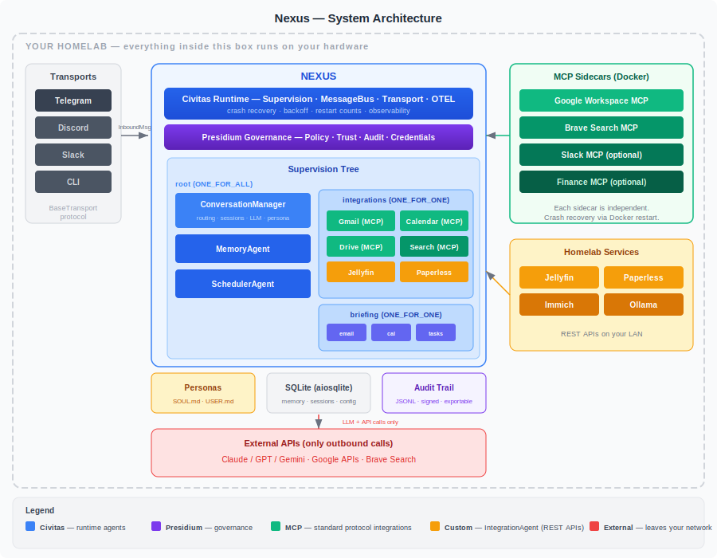

# Product Requirements Document
## Nexus
### *The reliable personal AI assistant — built on Civitas, governed by Presidium*

**Version:** 1.0 (Draft)
**Date:** 2026-05-08
**Author:** Jeryn
**Status:** Draft

---

## 1. Problem Statement

### The Reliability Gap

Personal AI assistants in 2026 fall into two categories:

1. **Massive and fragile** — OpenClaw (370K stars, 430K LOC, 44K skills) has unmatched breadth. It connects to 24 messaging platforms and has a thriving skill marketplace. But a crashed skill takes down the whole gateway. A Gmail API timeout blocks your calendar. You wake up to silence instead of your morning briefing because one integration threw an exception at 3am.

2. **Minimal and isolated** — Nanobot (42K stars, 4K LOC) proves you don't need a massive framework. But it's single-process, single-user, no fault tolerance. IronClaw (12K stars, Rust) has hardware-level security but limited integrations and a Rust barrier to entry.

**The gap:** Nobody has built a personal AI assistant that is simultaneously:

- **Reliable** — individual agents crash and restart without the user noticing
- **Governed** — actions are policy-enforced, trust is earned, credentials are scoped per agent
- **Multi-tenant** — a household shares one instance, each person with their own persona, profiles, and permissions
- **Observable** — real-time dashboard showing agent health, message flow, restart counts, trust scores
- **Private** — runs on your hardware, zero telemetry, only LLM API calls leave the network

### Why Reliability Is the Differentiator

Every project in the space competes on **breadth** (more channels, more skills, more integrations). Nobody competes on **reliability**.

This is the wrong priority order. A personal assistant that handles 24 messaging platforms but crashes silently at 3am is worse than one that handles 5 platforms and never goes down. Your morning briefing must arrive. Your scheduled tasks must execute. Your email triage must complete even when one integration is having a bad day.

Civitas's OTP-style supervision trees are the only technology in this space that provides genuine fault isolation and automatic recovery. No competitor has this. Not OpenClaw, not Hermes, not NanoClaw, not IronClaw.

**The demo that nobody else can do:**

> "I kill the Gmail agent mid-briefing. The supervisor detects the crash, restarts it with exponential backoff, and the briefing completes with the data that's available. The user sees a 2-second delay and a note that Gmail was temporarily unavailable. No error message. No manual restart. The Gmail agent is back before the next email check."

This is Nexus's reason to exist.

### Why Governance Matters for Personal Assistants

The governance gap in personal AI is not theoretical:

**Incident 1 — The Assistant That Sent Your Email.** A personal AI drafts a reply to your boss and auto-sends it because there's no approval gate on `send_email`. The reply is confidently wrong. No audit trail shows why the assistant decided to send it.

**Incident 2 — The Credential Inheritance Problem.** Your assistant has your full Gmail OAuth token. A prompt injection via a malicious email instructs the assistant to forward your inbox to an external address. The assistant complies — it has the credentials to do so.

**Incident 3 — The Household Privacy Breach.** Your partner asks the shared household assistant about your calendar. The assistant helpfully provides your full schedule including a surprise birthday party. No per-user permission scoping exists.

Presidium's governance primitives — policy enforcement, credential scoping, trust scores, audit trails — solve these at the architectural level, not with prompt engineering.

---

## 2. Product Vision

### Vision Statement

Nexus is the personal AI assistant that never goes down, never exceeds its authority, and gets better at serving you over time — because it's the only assistant built on a production-grade supervised runtime with runtime governance.

### The One-Line Position

> **Nexus is the most reliable personal AI assistant in open source — the only one where crashing an agent is a feature demo, not a bug report.**

### What Success Looks Like

You install Nexus on your homelab. Within 15 minutes, you're talking to it on Telegram. It reads your email, manages your calendar, monitors your homelab services, and delivers a morning briefing at 7am. Your partner joins with their own persona and permissions. When an integration has a bad day, you don't notice — the supervisor handles it. After a month, the assistant knows your preferences, drafts better replies, and earns enough trust to handle low-stakes emails autonomously.

---

## 3. Target Users

### Primary: Homelab Enthusiasts & Self-Hosters

- Run self-hosted services (Jellyfin, Immich, Paperless, etc.)
- Value privacy and data sovereignty
- Comfortable with `docker compose up` but don't want to babysit services
- Already use Telegram/Discord for notifications
- Want a single AI interface to their entire digital life

### Secondary: Civitas/Presidium Evaluators

- Developers evaluating Civitas as an agent runtime
- Looking for a real-world reference implementation beyond toy examples
- Want to see supervision trees, crash recovery, governance, and observability in action
- Enterprise teams assessing Presidium's governance model

### Tertiary: Small Households / Teams

- Multiple users sharing one Nexus instance
- Different permission levels per user (admin, member, restricted)
- Shared resources (household calendar, service monitoring) with private resources (personal email)
- Each person with their own persona and conversation style

---

## 4. Product Scope

### What Nexus Is

- A self-hosted personal AI assistant that runs on your hardware
- A showcase of Civitas's reliability (supervision, crash recovery, transport transparency)
- A showcase of Presidium's governance (policy enforcement, trust scores, credential scoping, audit)
- Multi-tenant, multi-profile, multi-transport from day one
- MCP-first for all external integrations (Gmail, Calendar, Drive, web search, etc.)
- Persona-driven — configurable personality via SOUL.md files

### What Nexus Is NOT

- Not a voice assistant — text-first via messaging apps. Voice is an optional layer, not the core.
- Not a workflow builder — no visual drag-and-drop. Code-first, YAML-configured.
- Not a managed service — self-hosted only. No cloud version.
- Not an OpenClaw clone — we don't compete on breadth (44K skills). We compete on reliability and governance.
- Not mobile-native — no phone app. Telegram/Discord on your phone is the mobile interface.
- Not a framework — Nexus is an application, not a toolkit for building other things.

---

## 5. Core Features

### F1 — Supervised Agent Architecture (Civitas Showcase)

**Problem it solves:** Every other personal AI assistant is a single point of failure.

**Description:**
Each integration (Gmail, Calendar, homelab services) runs as an independent `AgentProcess` in a Civitas supervision tree. Crashes are isolated, recovery is automatic, and the user experience is uninterrupted.

**Key behaviors:**
- Integration supervisor uses `ONE_FOR_ONE` — Gmail crashing doesn't restart Calendar
- Root supervisor uses `ONE_FOR_ALL` — if the conversation manager dies, restart everything cleanly
- Exponential backoff on restart — respects API rate limits
- Health monitoring — periodic checks detect degraded services before they crash
- Observable — restart counts, agent status, backoff state visible in dashboard and OTEL

**Supervision tree:**

```
nexus (root_supervisor, ONE_FOR_ALL)
├── conversation_manager          # Routes messages, manages sessions, LLM, skill execution
├── integrations (supervisor, ONE_FOR_ONE)
│   ├── [MCP servers]             # Gmail, Calendar, Drive, etc. (Docker sidecars)
│   └── [custom agents]           # Exception: only when MCP doesn't cover the use case
├── scheduler                     # Cron-based tasks, triggers skills
├── memory                        # Persistent facts, preferences, skills backup
├── llm_router                    # Task-based model selection + fallback
└── dashboard                     # GenServer — live topology + health, HTTP :8080
```

**Design principle:** Skills + MCP tools are the norm. Custom agents are the exception — only for bespoke code where no MCP server exists (custom API integration, custom rendering/UI). Morning briefing, email triage, task management are all skills, not hardcoded agents.

### F2 — Governance Layer (Presidium Showcase)

**Problem it solves:** Personal assistants act with your full credentials and no oversight.

**Description:**
Presidium's governance primitives are designed into Nexus from day one — not bolted on. Every action passes through policy evaluation. Trust is earned, not assumed.

**Key behaviors:**
- **Irreversibility gates:** Send email, accept calendar invite, delete anything → always requires approval
- **Reversibility-first:** Agent prefers archive over delete, draft over send, suggest over book
- **Trust-gated autonomy:** Agent starts supervised. After N accurate drafts approved without edits, trust grows. Low-stakes actions become autonomous. Bad output → trust decays → more approvals required.
- **Per-agent credential scoping:** Gmail agent gets gmail-scoped OAuth token only. Calendar agent gets calendar scope. No agent holds full credentials.
- **Audit trail:** Every action logged with agent identity, reasoning, policy state. Exportable.
- **Intent declaration:** Agent declares "processing inbox" — touching calendar without being asked triggers governance alert.

### F3 — Multi-Tenant / Multi-Profile

**Problem it solves:** Most personal assistants are single-user. Households need shared infrastructure with private boundaries.

**Description:**
Multiple users share one Nexus instance. Each user has their own persona, profiles (personal/work), permissions, memory, and conversation history. Shared resources (household calendar, service monitoring) are accessible to all; private resources (personal email) are scoped.

**Key behaviors:**
- **Tenant = user identity** — resolved from transport user ID (Telegram user ID, etc.)
- **Profiles per tenant** — personal, work, etc. Each with separate Google accounts, MCP servers, briefing preferences
- **Permissions** — `calendar.read`, `calendar.write`, `gmail.*`, `homelab.read`. Wildcard support. Read vs write enforced.
- **Persona per tenant** — each user can select a different persona (personality, tone, quirks)
- **Shared services** — homelab monitoring, household calendar overlay accessible to all tenants
- **Private services** — personal email, work Slack, private documents scoped to the owning tenant

### F4 — Persona System (SOUL.md)

**Problem it solves:** Personal assistants feel generic. Users want personality, not just capability.

**Description:**
Each Nexus persona is defined in a `SOUL.md` file — a markdown document describing personality, tone, values, quirks, and communication style. Personas are first-class, not a config afterthought.

**Key behaviors:**
- `SOUL.md` files in `~/.nexus/personas/` — human-readable, git-trackable, auditable
- Per-tenant persona selection — you get Dross, your partner gets Friday
- `nexus setup-persona` — conversational builder that helps create a persona interactively
- Persona injected into every LLM system prompt — consistent personality across all interactions
- `USER.md` per tenant — user preferences, facts, contacts (separate from persona)
- Governance: persona changes logged in audit trail. Personality drift detectable via Presidium eval.

### F5 — Multi-Transport

**Problem it solves:** Coupling to a single messaging platform limits reach and creates vendor lock-in.

**Description:**
`BaseTransport` protocol decouples the conversation engine from messaging platforms. Telegram first, but the architecture supports any transport without code changes to the agent layer.

**Key behaviors:**
- `BaseTransport` protocol — `send_text()`, `send_photo()`, `send_voice()`, `resolve_tenant()`
- `InboundMessage` dataclass — normalized message format, transport-agnostic
- Conversation manager never sees Telegram objects — only `InboundMessage`
- Reply via `reply_transport` reference on each message — no transport registry lookup
- Per-transport tenant resolution — Telegram user ID, Discord user ID, etc. all map to same tenant
- Telegram first. Discord, Slack, SMS, CLI planned as future transports.

### F6 — MCP-Prioritized Integrations

**Problem it solves:** Custom API wrappers are expensive to build and maintain. MCP provides a standard interface for the common case, but not every use case has a mature MCP server.

**Description:**
External service integrations prioritize MCP servers where they exist and are mature. Where MCP coverage is incomplete or insufficient, custom `AgentProcess` implementations fill the gap — using `IntegrationAgent` base class with HTTP client, auth, and health checks. Both paths are governed identically by Presidium.

**Key behaviors:**
- `MCPManager` connects to multiple MCP servers, merges tool schemas
- Google Workspace via MCP — Gmail, Calendar, Drive, Docs, Sheets, Keep, Tasks
- Web search via MCP — Brave Search or similar
- Each MCP server runs as a Docker sidecar
- Tool-use loop: LLM decides which tools to call, Nexus executes via MCP, results fed back
- Intent-based tool filtering — classify intent first, send only relevant tool schemas to LLM (saves tokens, improves accuracy)
- MCP server health checks with auto-reconnect
- **Fallback to custom agents** when MCP doesn't cover the use case — homelab services, specialized APIs, or integrations requiring stateful logic beyond tool-call-response
- Custom agents use `IntegrationAgent` base class (httpx async client, auth headers, health checks) — same pattern as Vigil's homelab skills
- Both MCP tools and custom agents are governed by the same Presidium policy engine — no governance gap between integration paths

### F7 — Three-Layer Memory

**Problem it solves:** Assistants forget across sessions, or accumulate unbounded context.

**Description:**
Memory is structured in three layers (inspired by Hermes Agent's architecture, adapted for governance):

| Layer | What it stores | How it's used |
|---|---|---|
| **Session (episodic)** | Conversation history per session | Context for current conversation. Checkpointed to survive restarts. |
| **Persistent (semantic)** | Facts, preferences, contacts, habits | "I'm vegetarian." "My boss is Sarah." Injected into system prompt. |
| **Skill (procedural)** | Learned procedures, recurring workflows | "How I triage email." Agent-generated, human-auditable. |

**Key behaviors:**
- Session memory checkpointed to SQLite via MemoryAgent — survives agent restarts
- Persistent memory updated from conversations — automatic fact extraction
- Skill memory as markdown files — readable, editable, git-trackable
- Retrieve-on-demand (FTS5 search) — not context-packing. Prevents window bloat.
- Per-tenant namespaced — memory isolation between users
- Dream consolidation — async background process summarizes old sessions

### F8 — Scheduled Tasks & Morning Briefing

**Problem it solves:** A reactive assistant that only responds when asked is half as useful.

**Description:**
Cron-based scheduled tasks execute proactively. The morning briefing is the flagship scheduled task — implemented as a **skill**, not hardcoded agents.

**Key behaviors:**
- Scheduler agent with cron expressions from config — triggers skill execution
- Morning briefing defined in `~/.nexus/skills/morning-briefing/SKILL.md` — editable, customizable, versionable
- Skill execution runs parallel MCP tool calls via `asyncio.TaskGroup` inside ConversationManager
- Each tool call uses cheap model (Haiku) via ModelRouter — saves cost and rate limits
- Per-tool-call timeout — briefing sends with available data, notes unavailable services
- No dedicated briefing agents — simplicity over infrastructure
- Customizable: users edit the SKILL.md to change format, add/remove sections, adjust timing
- State persistence — scheduler next-run timestamps survive restarts

### F9 — Observability (TUI + Web Dashboard)

**Problem it solves:** Invisible automation is untrustworthy automation. Homelab users need Nexus health visible alongside their other services.

**Description:**
Two dashboard surfaces: a terminal TUI (`nexus dashboard`) for quick checks, and an HTTP web dashboard for embedding in homelab dashboards (Homepage, Heimdall, Homarr, etc.).

#### F9a — TUI Dashboard

- Rich TUI (terminal-based, leveraging Civitas's existing dashboard)
- Per-agent status: running, crashed, restarting, idle
- Restart counts and backoff state
- Recent activity feed with latency and token usage
- `nexus dashboard` command

#### F9b — Web Dashboard (HTML UI)

Built on Civitas's `GenServer` for state management and `HTTPGateway` for serving.

**Architecture:**
- `DashboardServer(GenServer)` — maintains live topology state, agent health, trust scores, recent activity. GenServer's call/cast/info pattern gives thread-safe state access + supervision.
- `HTTPGateway` — serves the dashboard HTML + a JSON API. Embeddable in homelab dashboards via iframe or API widget.
- Static HTML + vanilla JS (no React/Vue build step) — single-page dashboard that polls the JSON API or uses SSE for live updates.

**Key behaviors:**
- **Topology view** — visual representation of the supervision tree. Which agents are running, which are restarted, which are in backoff. Live.
- **Agent health cards** — per-agent: status, restart count, last message time, trust score, backoff state
- **Recent activity feed** — last N actions with agent, action type, latency, token cost
- **Trust score panel** — per-agent trust scores with trend (Presidium integration)
- **MCP server health** — which MCP sidecars are connected, tool count, last health check
- **Embeddable** — serves on a configurable port (default 8080). Works as an iframe in Homepage/Heimdall/Homarr.
- **JSON API** — `/api/health`, `/api/topology`, `/api/agents`, `/api/activity` for custom integrations
- **OTEL export** — metrics exportable to Grafana, Prometheus for long-term monitoring

---

## 6. Architecture Overview



**Key principle:** Everything inside the homelab boundary runs on the user's hardware. The only outbound calls are to LLM APIs and Google APIs. Even those can be replaced — Google with local IMAP, Claude with Ollama.

---

## 7. Deployment

```yaml
# docker-compose.yaml
services:
  nexus:
    image: nexus:latest
    volumes:
      - ./config:/app/config
      - ./data:/app/data
      - ./personas:/app/personas
    environment:
      - ANTHROPIC_API_KEY=${ANTHROPIC_API_KEY}
      - TELEGRAM_BOT_TOKEN=${TELEGRAM_BOT_TOKEN}
    ports:
      - "8080:8080"  # Dashboard (future)
    restart: unless-stopped

  mcp-google:
    image: taylorwilsdon/google_workspace_mcp:latest
    volumes:
      - ./data/mcp-google:/app/data
    restart: unless-stopped
```

One `docker compose up`. Homelab-ready. No cloud dependency.

---

## 8. Success Criteria

### Functional
- Nexus handles 50+ interactions per day without manual intervention
- Agent crashes recover automatically within 5 seconds (user-imperceptible)
- Morning briefing arrives within ±5 minutes of configured time, even with partial MCP failures
- Multi-tenant: two users with separate personas and permissions on one instance
- Governance: irreversible actions require approval, trust score visible in dashboard

### Non-Functional
- Cold start (`docker compose up` → first response) under 30 seconds
- Response latency under 5 seconds for simple queries (excluding LLM inference)
- Memory usage under 512MB for base runtime with all agents
- Zero telemetry — no data leaves the network except LLM and Google API calls
- Works on Linux (primary), macOS, Windows (via Docker)

### Demo
- **Crash recovery demo** — kill an agent, watch seamless restart (the signature demo)
- **Governance demo** — attempt an unauthorized action, see policy denial + audit entry
- **Trust arc demo** — show trust growing over approved drafts, decaying on rejection
- **Multi-tenant demo** — two users, different personas, separate email, shared calendar
- New user: `git clone` → working assistant in under 15 minutes

---

## 9. Risks & Mitigations

| Risk | Impact | Mitigation |
|---|---|---|
| MCP server instability | Integrations unreliable | Supervision handles crash/restart. Briefing degrades gracefully. Health monitoring with auto-reconnect. |
| Google OAuth setup friction | First-run experience painful | `nexus setup google` CLI wizard. Clear documentation. MCP server handles OAuth complexity. |
| LLM costs for daily use | Expensive as daily driver | Intent-based tool filtering (send only relevant schemas). Local models for classification. Haiku for cheap tasks, Sonnet for complex. |
| Presidium not yet implemented | Governance features are mocked | Design governance hooks from day one. Implement lightweight in-memory policy + trust as stepping stones. Full Presidium integration when available. |
| Scope creep (too many integrations) | Never ships | Strict milestone gates. Each milestone demoable. MCP-first means adding integrations is config, not code. |
| OpenClaw ecosystem moat | Hard to compete on breadth | Don't compete on breadth. Compete on reliability, governance, multi-tenancy. Different audience. |
| Civitas SDK bugs surfaced by real use | Nexus blocked by framework issues | Nexus is the forcing function — file and fix Civitas bugs as they surface. |
| Big tech personal agents (Google Remy, Meta Hatch) | Commoditize the space | Open-source, self-hosted, privacy-first is the counter-positioning. Big tech agents send all data to their cloud. |

---

## 10. Resolved Questions

- [x] **Transport priority:** Telegram only for now. Transport abstraction (`BaseTransport`) ensures clean interface for adding others later. *(Decided 2026-05-08)*
- [x] **Homelab services:** Deferred. Not in initial milestones. Focus on Google Workspace + web search first. *(Decided 2026-05-08)*
- [x] **Skill system:** Yes — autonomous skill creation from the start. Borrow from public skill repos where available (OpenClaw SKILL.md format, Hermes skill patterns). Agent writes + improves its own skills, governed by approval gates. *(Decided 2026-05-08)*
- [x] **Local LLM priority:** Priority. Route through an LLM gateway/router with toggles — configurable per task type (classify → local, converse → cloud, fallback → local). Not a raw Ollama sidecar — a routing layer with model selection. *(Decided 2026-05-08)*
- [x] **Vigil migration:** No. Clean start. *(Decided 2026-05-08)*

## 11. Resolved Questions (Round 2)

- [x] **LLM gateway architecture:** `AgentProcess`. Gets supervision, hot-swap, observable in dashboard. Can swap to config-driven later if needed. *(Decided 2026-05-08)*
- [x] **Skill governance:** Telegram inline buttons for approval ("Nexus learned a new skill: [Approve] [Reject] [View]"). CLI as secondary. *(Decided 2026-05-08)*
- [x] **Briefing model selection:** Cheap model (Haiku) by default for briefing chunks. Configurable via LLM router. Saves cost and avoids rate-limit contention with conversation model. *(Decided 2026-05-08)*
- [x] **Memory backend:** SQLite + FTS5. Zero-dependency, sufficient for personal assistant scale. Vector search as optional extra later. *(Decided 2026-05-08)*

## 12. Open Questions

- [ ] **Dashboard embedding:** Best approach for embedding Nexus health dashboard in existing homelab dashboards (Homepage, Heimdall, etc.)? iFrame? API endpoint? Static HTML widget?
